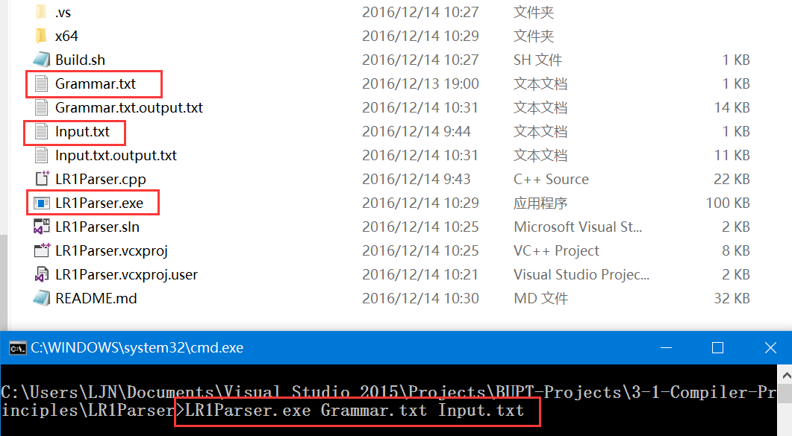

# 语法分析 - LR (1) 实验报告

> 2016/12/13

## 实验目的

1. 编程实现对算术表达式的语法分析程序
2. 理解并掌握语法分析程序

## 实验内容

实现如下文法的语法分析程序： 

```
E -> E + T | E - T | T
T -> T * F | T / F | F
F -> ( E ) | num
```

1. 实现**自动**构造识别所有活前缀的DFA
2. 实现**自动**构造LR(1)分析表
3. 实现LR(1)分析程序

## 算法设计

### Part 1

- 读入文法
- 拓广文法
- 构造LR(1)分析表
  - 找**First集**
    - Frist[终结符号] = { 终结符号 }
    - **遍历**每个产生式**每个符号**
      - First[产生式左端非终结符] += First[当前符号]
      - 如果First[当前符号]没有**epsilon**
        - **结束**遍历
      - 如果**全部遍历的**符号的First有**epsilon**
        - First[产生式左端非终结符] += { epsilon }
    - **循环**这个过程直到不再增加
  - 构造**项目集闭包**
    - **遍历**项目集中的**每个项目**
      - 如果该项目是**归约项目/移进项目**
        - 跳过这个项目
      - 构造一个**向前看集合**
      - 如果该**待约项目**的**圆点后符号**后边还有符号
        - 将后边的符号的Fisrt集加入**向前看集合**
        - 否则，将当前项目的**向前看符号**加入**向前看集合**
      - **遍历**圆点后符号的每个**产生式**
        - **遍历**向前看集合的每个**符号**
          - 将**圆点后符号**，产生式，向前看符号的**项目**加入闭包
    - **循环**这个过程直到不再增加
  - **go(项目集, 向前符号)**
    - **遍历**项目集中的**每个项目**
      - 如果该项目是**归约项目**
        - 跳过这个项目
      - 如果该项目**圆点后符号**为**向前符号**
        - 圆点后移产生**新项目**，加入**新项目集**
    - 返回**新项目集**的**闭包**
  - 建立**项目集规范组**，生成**分析表**
    - 将拓广符号，拓广产生式，dollar构成的项目的项目集的闭包 加入规范组
      **下标**从0开始记录
    - **下标**从0开始**遍历**项目集，直到下标与（**规范组**大小）相同
      - **遍历**每个文法符号
        - 用go函数产生新项目集
        - 如果**新项目集**非空，且不在规范组中
          - 将**新项目集**加入规范组，下标为（**规范组**大小）
          - 将**当前项目集**×**文法符号**到**新项目集**的动作加入分析表
    - **遍历**当前项目集的每个项目
      - 找到**归约项目**，将动作加入分析表
    - **下标** + 1，并反复这个过程；
- 打印文法
- 打印LR(1)项目集规范组
- 打印LR(1)分析表

### Part 2

- 读入待分析表达式集
- 分析表达式集
  - 切分表达式
  - 初始化分析器
    - 输入流尾部插入$
    - 分析栈压入开始状态0
  - 循环直到 输入读完
    - 判断**栈顶状态**×**当前输入**在分析表中的动作
    - 如果是shift
      - 转移状态入栈
      - 输入符号入栈
      - 输入指针后移
    - 如果是reduce
      - 如果归约式左边为起始符
        - 接受，结束分析
      - 将符号栈和状态栈弹出归约式个数的内容
      - 弹出时检查栈内符号和归约式符号匹配
      - 找到当前**栈顶状态**×**归约式左边符号**的goto动作
        - 找不到，则错误
      - goto状态入栈
      - 归约式左边符号入栈
    - 如果找不到动作
      - 错误
- 输出分析结果

## 实现细节

- 通过重载运算符 `==`，实现判断两个**LR(1)项目**是否相同
- 通过指定 `Hasher` 和 `unordered_set`，实现**项目集**数据结构（哈希集合）
- 用 `vector` 装入**项目集规范组**

``` cpp
struct Item
{
    ...
    bool operator == (const Item &op) const;
};

struct ItemHasher
{
    size_t operator() (const Item &obj) const;
};

using ItemSet = std::unordered_set<Item, ItemHasher>;

std::vector<ItemSet> itemSets;
```

- 通过指定 `Hasher` 实现**分析表**数据结构（哈希映射）

``` cpp
using TablePair = std::pair<ItemSet, std::string>;

struct PairHasher
{
    size_t operator() (
        const std::pair<size_t, std::string> &obj) const
    {
        // For msvc's ordering result :-)
        // Using Conflict to Aggregate entries with the Same State
        return obj.first;
    }
};

std::unordered_map<
    std::pair<size_t, std::string>,
    Action, PairHasher
> table;
```


## 输入输出

### `int main (int argc, char *argv[])`

- 检查`argc` 是否合法 (`argc >= 3`)
  - `argv[1]` 为语法定义文件
  - `argv[2]` 为待识别文件
- 打开输入/输出文件，并判断释放成功
- 将**语法定义文件输入流**传入`LR1Parser`，生成语法分析器
- 将**语法输出流**用于打印**语法**及**LR(1)项目集规范组/分析表**
- 将**待识别文件 输入/输出 流**传入`LR1Parser.Parse`进行分析

### 输入格式

文件允许的换行符：
- Windows `\r\n`
- Linux `\n`

#### 语法定义文件

每个非终止符号的**所有推导**用**一行**列出，**各个产生式**用**管道线**隔开，
**各个符号**之间用**界符**隔开：

```
E -> E + T | E - T | T
```

- `->` 表示**推导运算**
- `|` 表示**管道线**
- ` ` （空格）表示符号间的**界符**
- `num` 表示**数字**
- 不填 表示**空产生式**
- **其他符号** 表示文法的符号
  - 在 `->` 前出现的符号 为**非终止符号**
  - 所有符号除了非终止符号 为**终止符号**

#### 待识别文件

**行**为单位的**待分析表达式**

### 输出格式

#### 语法输出

- 拓广文法
- LR(1)项目集规范组
- LR(1)分析表

#### 待识别文件输出

每一个**待分析表达式**的 **LR分析过程** （生成markdown表格）

## 运行样例

Windows下，在工作路径下的命令行输入

``` cmd
LR1Parser.exe Grammar.txt Input.txt
```



### Input

#### Grammar.txt

```
E -> E + T | E - T | T
T -> T * F | T / F | F
F -> ( E ) | num
```

#### Input.txt

```
5+5*3
(3.5/(2-4*.8/2)-2*3.+(2/(2)-2))+2
 (3.3 - 2) * + ( * + 2
```

### Output

#### Grammar.txt.output.txt

```
Grammar:
Starting Symbol:
	E'
Non Terminal Symbols:
	E T F E' 
Terminal Symbols:
	+ - * / ( ) num 
Production Rules:
	E -> E + T | E - T | T
	T -> T * F | T / F | F
	F -> ( E ) | num
	E' -> E

LR1 Item Sets:
Item Set 0:
    E -> ~ E - T | -
    E -> ~ E + T | -
    E -> ~ E - T | +
    E -> ~ E + T | +
    E' -> ~ E | $
    E -> ~ E + T | $
    E -> ~ E - T | $
    F -> ~ num | -
    F -> ~ num | +
    F -> ~ num | *
    F -> ~ num | /
    F -> ~ num | $
    T -> ~ T / F | /
    T -> ~ T * F | /
    T -> ~ T / F | *
    T -> ~ T * F | *
    T -> ~ T / F | +
    T -> ~ T * F | +
    T -> ~ T / F | -
    T -> ~ T * F | -
    E -> ~ T | -
    E -> ~ T | +
    E -> ~ T | $
    T -> ~ T * F | $
    T -> ~ T / F | $
    T -> ~ F | /
    T -> ~ F | *
    T -> ~ F | +
    T -> ~ F | -
    T -> ~ F | $
    F -> ~ ( E ) | -
    F -> ~ ( E ) | +
    F -> ~ ( E ) | *
    F -> ~ ( E ) | /
    F -> ~ ( E ) | $
Item Set 1:
    E -> E ~ - T | $
    E -> E ~ + T | $
    E' -> E ~ | $
    E -> E ~ + T | +
    E -> E ~ - T | +
    E -> E ~ + T | -
    E -> E ~ - T | -
Item Set 2:
    T -> T ~ / F | $
    T -> T ~ * F | $
    E -> T ~ | $
    E -> T ~ | +
    T -> T ~ / F | /
    T -> T ~ * F | /
    T -> T ~ / F | *
    T -> T ~ * F | *
    T -> T ~ / F | +
    T -> T ~ * F | +
    T -> T ~ / F | -
    T -> T ~ * F | -
    E -> T ~ | -
Item Set 3:
    T -> F ~ | $
    T -> F ~ | -
    T -> F ~ | +
    T -> F ~ | *
    T -> F ~ | /
Item Set 4:
    F -> ~ ( E ) | /
    F -> ~ ( E ) | *
    F -> ~ ( E ) | +
    F -> ~ ( E ) | -
    F -> ~ ( E ) | )
    F -> ( ~ E ) | -
    F -> ( ~ E ) | +
    F -> ( ~ E ) | *
    F -> ( ~ E ) | /
    F -> ( ~ E ) | $
    E -> ~ E - T | +
    E -> ~ E + T | +
    E -> ~ E - T | -
    E -> ~ E + T | )
    E -> ~ E - T | )
    E -> ~ E + T | -
    T -> ~ T / F | *
    T -> ~ T * F | *
    T -> ~ T / F | /
    T -> ~ T * F | /
    T -> ~ T / F | )
    T -> ~ T * F | )
    T -> ~ T / F | -
    T -> ~ T * F | -
    T -> ~ T / F | +
    T -> ~ T * F | +
    E -> ~ T | +
    E -> ~ T | -
    E -> ~ T | )
    T -> ~ F | *
    T -> ~ F | /
    T -> ~ F | )
    T -> ~ F | -
    T -> ~ F | +
    F -> ~ num | /
    F -> ~ num | *
    F -> ~ num | +
    F -> ~ num | -
    F -> ~ num | )
Item Set 5:
    F -> num ~ | $
    F -> num ~ | /
    F -> num ~ | *
    F -> num ~ | +
    F -> num ~ | -
Item Set 6:
    E -> E + ~ T | $
    E -> E + ~ T | +
    E -> E + ~ T | -
    T -> ~ T / F | $
    T -> ~ T * F | $
    T -> ~ T / F | /
    T -> ~ T * F | /
    T -> ~ T / F | *
    T -> ~ T * F | *
    T -> ~ T * F | -
    T -> ~ T / F | -
    T -> ~ T * F | +
    T -> ~ T / F | +
    T -> ~ F | $
    T -> ~ F | /
    T -> ~ F | *
    T -> ~ F | -
    T -> ~ F | +
    F -> ~ ( E ) | $
    F -> ~ ( E ) | +
    F -> ~ ( E ) | -
    F -> ~ ( E ) | *
    F -> ~ ( E ) | /
    F -> ~ num | $
    F -> ~ num | +
    F -> ~ num | -
    F -> ~ num | *
    F -> ~ num | /
Item Set 7:
    E -> E - ~ T | $
    E -> E - ~ T | +
    E -> E - ~ T | -
    T -> ~ T / F | $
    T -> ~ T * F | $
    T -> ~ T / F | /
    T -> ~ T * F | /
    T -> ~ T / F | *
    T -> ~ T * F | *
    T -> ~ T * F | -
    T -> ~ T / F | -
    T -> ~ T * F | +
    T -> ~ T / F | +
    T -> ~ F | $
    T -> ~ F | /
    T -> ~ F | *
    T -> ~ F | -
    T -> ~ F | +
    F -> ~ ( E ) | $
    F -> ~ ( E ) | +
    F -> ~ ( E ) | -
    F -> ~ ( E ) | *
    F -> ~ ( E ) | /
    F -> ~ num | $
    F -> ~ num | +
    F -> ~ num | -
    F -> ~ num | *
    F -> ~ num | /
Item Set 8:
    F -> ~ num | *
    F -> ~ num | /
    F -> ~ num | $
    F -> ~ num | -
    F -> ~ num | +
    T -> T * ~ F | $
    T -> T * ~ F | /
    T -> T * ~ F | *
    T -> T * ~ F | +
    T -> T * ~ F | -
    F -> ~ ( E ) | *
    F -> ~ ( E ) | /
    F -> ~ ( E ) | $
    F -> ~ ( E ) | -
    F -> ~ ( E ) | +
Item Set 9:
    F -> ~ num | *
    F -> ~ num | /
    F -> ~ num | $
    F -> ~ num | -
    F -> ~ num | +
    T -> T / ~ F | $
    T -> T / ~ F | /
    T -> T / ~ F | *
    T -> T / ~ F | +
    T -> T / ~ F | -
    F -> ~ ( E ) | *
    F -> ~ ( E ) | /
    F -> ~ ( E ) | $
    F -> ~ ( E ) | -
    F -> ~ ( E ) | +
Item Set 10:
    F -> ( E ~ ) | -
    F -> ( E ~ ) | +
    F -> ( E ~ ) | *
    F -> ( E ~ ) | /
    F -> ( E ~ ) | $
    E -> E ~ + T | -
    E -> E ~ - T | )
    E -> E ~ - T | +
    E -> E ~ + T | +
    E -> E ~ - T | -
    E -> E ~ + T | )
Item Set 11:
    E -> T ~ | )
    E -> T ~ | -
    E -> T ~ | +
    T -> T ~ * F | +
    T -> T ~ / F | *
    T -> T ~ * F | *
    T -> T ~ / F | /
    T -> T ~ * F | /
    T -> T ~ / F | )
    T -> T ~ * F | )
    T -> T ~ / F | -
    T -> T ~ * F | -
    T -> T ~ / F | +
Item Set 12:
    T -> F ~ | +
    T -> F ~ | -
    T -> F ~ | )
    T -> F ~ | /
    T -> F ~ | *
Item Set 13:
    F -> ~ ( E ) | /
    F -> ~ ( E ) | *
    F -> ~ ( E ) | +
    F -> ~ ( E ) | -
    F -> ~ ( E ) | )
    F -> ( ~ E ) | /
    F -> ( ~ E ) | *
    F -> ( ~ E ) | +
    F -> ( ~ E ) | -
    F -> ( ~ E ) | )
    E -> ~ E - T | +
    E -> ~ E + T | +
    E -> ~ E - T | -
    E -> ~ E + T | )
    E -> ~ E - T | )
    E -> ~ E + T | -
    T -> ~ T / F | *
    T -> ~ T * F | *
    T -> ~ T / F | /
    T -> ~ T * F | /
    T -> ~ T / F | )
    T -> ~ T * F | )
    T -> ~ T / F | -
    T -> ~ T * F | -
    T -> ~ T / F | +
    T -> ~ T * F | +
    E -> ~ T | +
    E -> ~ T | -
    E -> ~ T | )
    T -> ~ F | *
    T -> ~ F | /
    T -> ~ F | )
    T -> ~ F | -
    T -> ~ F | +
    F -> ~ num | /
    F -> ~ num | *
    F -> ~ num | +
    F -> ~ num | -
    F -> ~ num | )
Item Set 14:
    F -> num ~ | )
    F -> num ~ | -
    F -> num ~ | +
    F -> num ~ | *
    F -> num ~ | /
Item Set 15:
    E -> E + T ~ | $
    E -> E + T ~ | +
    E -> E + T ~ | -
    T -> T ~ / F | +
    T -> T ~ * F | +
    T -> T ~ / F | -
    T -> T ~ * F | -
    T -> T ~ / F | $
    T -> T ~ * F | $
    T -> T ~ / F | /
    T -> T ~ * F | /
    T -> T ~ / F | *
    T -> T ~ * F | *
Item Set 16:
    E -> E - T ~ | $
    E -> E - T ~ | +
    E -> E - T ~ | -
    T -> T ~ / F | +
    T -> T ~ * F | +
    T -> T ~ / F | -
    T -> T ~ * F | -
    T -> T ~ / F | $
    T -> T ~ * F | $
    T -> T ~ / F | /
    T -> T ~ * F | /
    T -> T ~ / F | *
    T -> T ~ * F | *
Item Set 17:
    T -> T * F ~ | -
    T -> T * F ~ | +
    T -> T * F ~ | *
    T -> T * F ~ | /
    T -> T * F ~ | $
Item Set 18:
    T -> T / F ~ | -
    T -> T / F ~ | +
    T -> T / F ~ | *
    T -> T / F ~ | /
    T -> T / F ~ | $
Item Set 19:
    E -> E + ~ T | -
    E -> E + ~ T | +
    E -> E + ~ T | )
    T -> ~ T / F | -
    T -> ~ T * F | -
    T -> ~ T / F | /
    T -> ~ T * F | /
    T -> ~ T / F | *
    T -> ~ T * F | *
    T -> ~ T * F | )
    T -> ~ T / F | )
    T -> ~ T * F | +
    T -> ~ T / F | +
    T -> ~ F | -
    T -> ~ F | /
    T -> ~ F | *
    T -> ~ F | )
    T -> ~ F | +
    F -> ~ ( E ) | -
    F -> ~ ( E ) | +
    F -> ~ ( E ) | )
    F -> ~ ( E ) | *
    F -> ~ ( E ) | /
    F -> ~ num | -
    F -> ~ num | +
    F -> ~ num | )
    F -> ~ num | *
    F -> ~ num | /
Item Set 20:
    E -> E - ~ T | )
    E -> E - ~ T | +
    E -> E - ~ T | -
    T -> ~ T / F | )
    T -> ~ T * F | )
    T -> ~ T / F | /
    T -> ~ T * F | /
    T -> ~ T / F | *
    T -> ~ T * F | *
    T -> ~ T * F | -
    T -> ~ T / F | -
    T -> ~ T * F | +
    T -> ~ T / F | +
    T -> ~ F | )
    T -> ~ F | /
    T -> ~ F | *
    T -> ~ F | -
    T -> ~ F | +
    F -> ~ ( E ) | )
    F -> ~ ( E ) | +
    F -> ~ ( E ) | -
    F -> ~ ( E ) | *
    F -> ~ ( E ) | /
    F -> ~ num | )
    F -> ~ num | +
    F -> ~ num | -
    F -> ~ num | *
    F -> ~ num | /
Item Set 21:
    F -> ( E ) ~ | $
    F -> ( E ) ~ | /
    F -> ( E ) ~ | *
    F -> ( E ) ~ | +
    F -> ( E ) ~ | -
Item Set 22:
    F -> ~ num | /
    F -> ~ num | *
    F -> ~ num | +
    F -> ~ num | -
    F -> ~ num | )
    T -> T * ~ F | +
    T -> T * ~ F | *
    T -> T * ~ F | /
    T -> T * ~ F | )
    T -> T * ~ F | -
    F -> ~ ( E ) | /
    F -> ~ ( E ) | *
    F -> ~ ( E ) | +
    F -> ~ ( E ) | -
    F -> ~ ( E ) | )
Item Set 23:
    F -> ~ num | )
    F -> ~ num | /
    F -> ~ num | *
    F -> ~ num | +
    F -> ~ num | -
    T -> T / ~ F | *
    T -> T / ~ F | /
    T -> T / ~ F | )
    T -> T / ~ F | -
    T -> T / ~ F | +
    F -> ~ ( E ) | )
    F -> ~ ( E ) | /
    F -> ~ ( E ) | *
    F -> ~ ( E ) | +
    F -> ~ ( E ) | -
Item Set 24:
    F -> ( E ~ ) | /
    F -> ( E ~ ) | *
    F -> ( E ~ ) | +
    F -> ( E ~ ) | -
    F -> ( E ~ ) | )
    E -> E ~ + T | -
    E -> E ~ - T | )
    E -> E ~ - T | +
    E -> E ~ + T | +
    E -> E ~ - T | -
    E -> E ~ + T | )
Item Set 25:
    E -> E + T ~ | -
    E -> E + T ~ | +
    E -> E + T ~ | )
    T -> T ~ / F | +
    T -> T ~ * F | +
    T -> T ~ / F | )
    T -> T ~ * F | )
    T -> T ~ / F | -
    T -> T ~ * F | -
    T -> T ~ / F | /
    T -> T ~ * F | /
    T -> T ~ / F | *
    T -> T ~ * F | *
Item Set 26:
    E -> E - T ~ | )
    E -> E - T ~ | +
    E -> E - T ~ | -
    T -> T ~ / F | +
    T -> T ~ * F | +
    T -> T ~ / F | -
    T -> T ~ * F | -
    T -> T ~ / F | )
    T -> T ~ * F | )
    T -> T ~ / F | /
    T -> T ~ * F | /
    T -> T ~ / F | *
    T -> T ~ * F | *
Item Set 27:
    T -> T * F ~ | -
    T -> T * F ~ | )
    T -> T * F ~ | /
    T -> T * F ~ | *
    T -> T * F ~ | +
Item Set 28:
    T -> T / F ~ | +
    T -> T / F ~ | -
    T -> T / F ~ | )
    T -> T / F ~ | /
    T -> T / F ~ | *
Item Set 29:
    F -> ( E ) ~ | )
    F -> ( E ) ~ | -
    F -> ( E ) ~ | +
    F -> ( E ) ~ | *
    F -> ( E ) ~ | /

LR1 Table:
< 0, num  >  =>  shift 5
< 0, (    >  =>  shift 4
< 0, F    >  =>  goto 3
< 0, T    >  =>  goto 2
< 0, E    >  =>  goto 1
< 1, $    >  =>  acc
< 1, -    >  =>  shift 7
< 1, +    >  =>  shift 6
< 2, *    >  =>  shift 8
< 2, /    >  =>  shift 9
< 2, $    >  =>  reduce by E -> T 
< 2, +    >  =>  reduce by E -> T 
< 2, -    >  =>  reduce by E -> T 
< 3, $    >  =>  reduce by T -> F 
< 3, -    >  =>  reduce by T -> F 
< 3, +    >  =>  reduce by T -> F 
< 3, *    >  =>  reduce by T -> F 
< 3, /    >  =>  reduce by T -> F 
< 4, E    >  =>  goto 10
< 4, T    >  =>  goto 11
< 4, F    >  =>  goto 12
< 4, (    >  =>  shift 13
< 4, num  >  =>  shift 14
< 5, $    >  =>  reduce by F -> num 
< 5, /    >  =>  reduce by F -> num 
< 5, *    >  =>  reduce by F -> num 
< 5, +    >  =>  reduce by F -> num 
< 5, -    >  =>  reduce by F -> num 
< 6, T    >  =>  goto 15
< 6, F    >  =>  goto 3
< 6, (    >  =>  shift 4
< 6, num  >  =>  shift 5
< 7, T    >  =>  goto 16
< 7, F    >  =>  goto 3
< 7, (    >  =>  shift 4
< 7, num  >  =>  shift 5
< 8, F    >  =>  goto 17
< 8, (    >  =>  shift 4
< 8, num  >  =>  shift 5
< 9, F    >  =>  goto 18
< 9, (    >  =>  shift 4
< 9, num  >  =>  shift 5
<10, +    >  =>  shift 19
<10, -    >  =>  shift 20
<10, )    >  =>  shift 21
<11, *    >  =>  shift 22
<11, /    >  =>  shift 23
<11, )    >  =>  reduce by E -> T 
<11, -    >  =>  reduce by E -> T 
<11, +    >  =>  reduce by E -> T 
<12, +    >  =>  reduce by T -> F 
<12, -    >  =>  reduce by T -> F 
<12, )    >  =>  reduce by T -> F 
<12, /    >  =>  reduce by T -> F 
<12, *    >  =>  reduce by T -> F 
<13, E    >  =>  goto 24
<13, T    >  =>  goto 11
<13, F    >  =>  goto 12
<13, (    >  =>  shift 13
<13, num  >  =>  shift 14
<14, )    >  =>  reduce by F -> num 
<14, -    >  =>  reduce by F -> num 
<14, +    >  =>  reduce by F -> num 
<14, *    >  =>  reduce by F -> num 
<14, /    >  =>  reduce by F -> num 
<15, -    >  =>  reduce by E -> E + T 
<15, +    >  =>  reduce by E -> E + T 
<15, $    >  =>  reduce by E -> E + T 
<15, /    >  =>  shift 9
<15, *    >  =>  shift 8
<16, -    >  =>  reduce by E -> E - T 
<16, +    >  =>  reduce by E -> E - T 
<16, $    >  =>  reduce by E -> E - T 
<16, /    >  =>  shift 9
<16, *    >  =>  shift 8
<17, $    >  =>  reduce by T -> T * F 
<17, /    >  =>  reduce by T -> T * F 
<17, *    >  =>  reduce by T -> T * F 
<17, +    >  =>  reduce by T -> T * F 
<17, -    >  =>  reduce by T -> T * F 
<18, $    >  =>  reduce by T -> T / F 
<18, /    >  =>  reduce by T -> T / F 
<18, *    >  =>  reduce by T -> T / F 
<18, +    >  =>  reduce by T -> T / F 
<18, -    >  =>  reduce by T -> T / F 
<19, num  >  =>  shift 14
<19, (    >  =>  shift 13
<19, F    >  =>  goto 12
<19, T    >  =>  goto 25
<20, num  >  =>  shift 14
<20, (    >  =>  shift 13
<20, F    >  =>  goto 12
<20, T    >  =>  goto 26
<21, -    >  =>  reduce by F -> ( E ) 
<21, +    >  =>  reduce by F -> ( E ) 
<21, *    >  =>  reduce by F -> ( E ) 
<21, /    >  =>  reduce by F -> ( E ) 
<21, $    >  =>  reduce by F -> ( E ) 
<22, num  >  =>  shift 14
<22, (    >  =>  shift 13
<22, F    >  =>  goto 27
<23, num  >  =>  shift 14
<23, (    >  =>  shift 13
<23, F    >  =>  goto 28
<24, )    >  =>  shift 29
<24, -    >  =>  shift 20
<24, +    >  =>  shift 19
<25, )    >  =>  reduce by E -> E + T 
<25, +    >  =>  reduce by E -> E + T 
<25, -    >  =>  reduce by E -> E + T 
<25, /    >  =>  shift 23
<25, *    >  =>  shift 22
<26, -    >  =>  reduce by E -> E - T 
<26, +    >  =>  reduce by E -> E - T 
<26, )    >  =>  reduce by E -> E - T 
<26, /    >  =>  shift 23
<26, *    >  =>  shift 22
<27, +    >  =>  reduce by T -> T * F 
<27, *    >  =>  reduce by T -> T * F 
<27, /    >  =>  reduce by T -> T * F 
<27, )    >  =>  reduce by T -> T * F 
<27, -    >  =>  reduce by T -> T * F 
<28, *    >  =>  reduce by T -> T / F 
<28, /    >  =>  reduce by T -> T / F 
<28, )    >  =>  reduce by T -> T / F 
<28, -    >  =>  reduce by T -> T / F 
<28, +    >  =>  reduce by T -> T / F 
<29, /    >  =>  reduce by F -> ( E ) 
<29, *    >  =>  reduce by F -> ( E ) 
<29, +    >  =>  reduce by F -> ( E ) 
<29, -    >  =>  reduce by F -> ( E ) 
<29, )    >  =>  reduce by F -> ( E ) 
```

#### Input.txt.output.txt


Parse `5+5*3` :

Stack                     | Input        | Action
------------------------- | ------------ | ---------------------
0                         | num+num*num$ | shift 5
0 num 5                   |    +num*num$ | reduce by F -> num 
0 F 3                     |    +num*num$ | reduce by T -> F 
0 T 2                     |    +num*num$ | reduce by E -> T 
0 E 1                     |    +num*num$ | shift 6
0 E 1 + 6                 |     num*num$ | shift 5
0 E 1 + 6 num 5           |        *num$ | reduce by F -> num 
0 E 1 + 6 F 3             |        *num$ | reduce by T -> F 
0 E 1 + 6 T 15            |        *num$ | shift 8
0 E 1 + 6 T 15 * 8        |         num$ | shift 5
0 E 1 + 6 T 15 * 8 num 5  |            $ | reduce by F -> num 
0 E 1 + 6 T 15 * 8 F 17   |            $ | reduce by T -> F * T 
0 E 1 + 6 T 15            |            $ | reduce by E -> T + E 
0 E 1                     |            $ | accept

Parse `(3.5/(2-4*.8/2)-2*3.+(2/(2)-2))+2` :

Stack                                            | Input                                                | Action
------------------------------------------------ | ---------------------------------------------------- | ---------------------
0                                                | (num/(num-num*num/num)-num*num+(num/(num)-num))+num$ | shift 4
0 ( 4                                            |  num/(num-num*num/num)-num*num+(num/(num)-num))+num$ | shift 14
0 ( 4 num 14                                     |     /(num-num*num/num)-num*num+(num/(num)-num))+num$ | reduce by F -> num 
0 ( 4 F 12                                       |     /(num-num*num/num)-num*num+(num/(num)-num))+num$ | reduce by T -> F 
0 ( 4 T 11                                       |     /(num-num*num/num)-num*num+(num/(num)-num))+num$ | shift 23
0 ( 4 T 11 / 23                                  |      (num-num*num/num)-num*num+(num/(num)-num))+num$ | shift 13
0 ( 4 T 11 / 23 ( 13                             |       num-num*num/num)-num*num+(num/(num)-num))+num$ | shift 14
0 ( 4 T 11 / 23 ( 13 num 14                      |          -num*num/num)-num*num+(num/(num)-num))+num$ | reduce by F -> num 
0 ( 4 T 11 / 23 ( 13 F 12                        |          -num*num/num)-num*num+(num/(num)-num))+num$ | reduce by T -> F 
0 ( 4 T 11 / 23 ( 13 T 11                        |          -num*num/num)-num*num+(num/(num)-num))+num$ | reduce by E -> T 
0 ( 4 T 11 / 23 ( 13 E 24                        |          -num*num/num)-num*num+(num/(num)-num))+num$ | shift 20
0 ( 4 T 11 / 23 ( 13 E 24 - 20                   |           num*num/num)-num*num+(num/(num)-num))+num$ | shift 14
0 ( 4 T 11 / 23 ( 13 E 24 - 20 num 14            |              *num/num)-num*num+(num/(num)-num))+num$ | reduce by F -> num 
0 ( 4 T 11 / 23 ( 13 E 24 - 20 F 12              |              *num/num)-num*num+(num/(num)-num))+num$ | reduce by T -> F 
0 ( 4 T 11 / 23 ( 13 E 24 - 20 T 26              |              *num/num)-num*num+(num/(num)-num))+num$ | shift 22
0 ( 4 T 11 / 23 ( 13 E 24 - 20 T 26 * 22         |               num/num)-num*num+(num/(num)-num))+num$ | shift 14
0 ( 4 T 11 / 23 ( 13 E 24 - 20 T 26 * 22 num 14  |                  /num)-num*num+(num/(num)-num))+num$ | reduce by F -> num 
0 ( 4 T 11 / 23 ( 13 E 24 - 20 T 26 * 22 F 27    |                  /num)-num*num+(num/(num)-num))+num$ | reduce by T -> F * T 
0 ( 4 T 11 / 23 ( 13 E 24 - 20 T 26              |                  /num)-num*num+(num/(num)-num))+num$ | shift 23
0 ( 4 T 11 / 23 ( 13 E 24 - 20 T 26 / 23         |                   num)-num*num+(num/(num)-num))+num$ | shift 14
0 ( 4 T 11 / 23 ( 13 E 24 - 20 T 26 / 23 num 14  |                      )-num*num+(num/(num)-num))+num$ | reduce by F -> num 
0 ( 4 T 11 / 23 ( 13 E 24 - 20 T 26 / 23 F 28    |                      )-num*num+(num/(num)-num))+num$ | reduce by T -> F / T 
0 ( 4 T 11 / 23 ( 13 E 24 - 20 T 26              |                      )-num*num+(num/(num)-num))+num$ | reduce by E -> T - E 
0 ( 4 T 11 / 23 ( 13 E 24                        |                      )-num*num+(num/(num)-num))+num$ | shift 29
0 ( 4 T 11 / 23 ( 13 E 24 ) 29                   |                       -num*num+(num/(num)-num))+num$ | reduce by F -> ) E ( 
0 ( 4 T 11 / 23 F 28                             |                       -num*num+(num/(num)-num))+num$ | reduce by T -> F / T 
0 ( 4 T 11                                       |                       -num*num+(num/(num)-num))+num$ | reduce by E -> T 
0 ( 4 E 10                                       |                       -num*num+(num/(num)-num))+num$ | shift 20
0 ( 4 E 10 - 20                                  |                        num*num+(num/(num)-num))+num$ | shift 14
0 ( 4 E 10 - 20 num 14                           |                           *num+(num/(num)-num))+num$ | reduce by F -> num 
0 ( 4 E 10 - 20 F 12                             |                           *num+(num/(num)-num))+num$ | reduce by T -> F 
0 ( 4 E 10 - 20 T 26                             |                           *num+(num/(num)-num))+num$ | shift 22
0 ( 4 E 10 - 20 T 26 * 22                        |                            num+(num/(num)-num))+num$ | shift 14
0 ( 4 E 10 - 20 T 26 * 22 num 14                 |                               +(num/(num)-num))+num$ | reduce by F -> num 
0 ( 4 E 10 - 20 T 26 * 22 F 27                   |                               +(num/(num)-num))+num$ | reduce by T -> F * T 
0 ( 4 E 10 - 20 T 26                             |                               +(num/(num)-num))+num$ | reduce by E -> T - E 
0 ( 4 E 10                                       |                               +(num/(num)-num))+num$ | shift 19
0 ( 4 E 10 + 19                                  |                                (num/(num)-num))+num$ | shift 13
0 ( 4 E 10 + 19 ( 13                             |                                 num/(num)-num))+num$ | shift 14
0 ( 4 E 10 + 19 ( 13 num 14                      |                                    /(num)-num))+num$ | reduce by F -> num 
0 ( 4 E 10 + 19 ( 13 F 12                        |                                    /(num)-num))+num$ | reduce by T -> F 
0 ( 4 E 10 + 19 ( 13 T 11                        |                                    /(num)-num))+num$ | shift 23
0 ( 4 E 10 + 19 ( 13 T 11 / 23                   |                                     (num)-num))+num$ | shift 13
0 ( 4 E 10 + 19 ( 13 T 11 / 23 ( 13              |                                      num)-num))+num$ | shift 14
0 ( 4 E 10 + 19 ( 13 T 11 / 23 ( 13 num 14       |                                         )-num))+num$ | reduce by F -> num 
0 ( 4 E 10 + 19 ( 13 T 11 / 23 ( 13 F 12         |                                         )-num))+num$ | reduce by T -> F 
0 ( 4 E 10 + 19 ( 13 T 11 / 23 ( 13 T 11         |                                         )-num))+num$ | reduce by E -> T 
0 ( 4 E 10 + 19 ( 13 T 11 / 23 ( 13 E 24         |                                         )-num))+num$ | shift 29
0 ( 4 E 10 + 19 ( 13 T 11 / 23 ( 13 E 24 ) 29    |                                          -num))+num$ | reduce by F -> ) E ( 
0 ( 4 E 10 + 19 ( 13 T 11 / 23 F 28              |                                          -num))+num$ | reduce by T -> F / T 
0 ( 4 E 10 + 19 ( 13 T 11                        |                                          -num))+num$ | reduce by E -> T 
0 ( 4 E 10 + 19 ( 13 E 24                        |                                          -num))+num$ | shift 20
0 ( 4 E 10 + 19 ( 13 E 24 - 20                   |                                           num))+num$ | shift 14
0 ( 4 E 10 + 19 ( 13 E 24 - 20 num 14            |                                              ))+num$ | reduce by F -> num 
0 ( 4 E 10 + 19 ( 13 E 24 - 20 F 12              |                                              ))+num$ | reduce by T -> F 
0 ( 4 E 10 + 19 ( 13 E 24 - 20 T 26              |                                              ))+num$ | reduce by E -> T - E 
0 ( 4 E 10 + 19 ( 13 E 24                        |                                              ))+num$ | shift 29
0 ( 4 E 10 + 19 ( 13 E 24 ) 29                   |                                               )+num$ | reduce by F -> ) E ( 
0 ( 4 E 10 + 19 F 12                             |                                               )+num$ | reduce by T -> F 
0 ( 4 E 10 + 19 T 25                             |                                               )+num$ | reduce by E -> T + E 
0 ( 4 E 10                                       |                                               )+num$ | shift 21
0 ( 4 E 10 ) 21                                  |                                                +num$ | reduce by F -> ) E ( 
0 F 3                                            |                                                +num$ | reduce by T -> F 
0 T 2                                            |                                                +num$ | reduce by E -> T 
0 E 1                                            |                                                +num$ | shift 6
0 E 1 + 6                                        |                                                 num$ | shift 5
0 E 1 + 6 num 5                                  |                                                    $ | reduce by F -> num 
0 E 1 + 6 F 3                                    |                                                    $ | reduce by T -> F 
0 E 1 + 6 T 15                                   |                                                    $ | reduce by E -> T + E 
0 E 1                                            |                                                    $ | accept

Parse ` (3.3 - 2) * + ( * + 2` :

Stack                   | Input              | Action
----------------------- | ------------------ | ---------------------
0                       | (num-num)*+(*+num$ | shift 4
0 ( 4                   |  num-num)*+(*+num$ | shift 14
0 ( 4 num 14            |     -num)*+(*+num$ | reduce by F -> num 
0 ( 4 F 12              |     -num)*+(*+num$ | reduce by T -> F 
0 ( 4 T 11              |     -num)*+(*+num$ | reduce by E -> T 
0 ( 4 E 10              |     -num)*+(*+num$ | shift 20
0 ( 4 E 10 - 20         |      num)*+(*+num$ | shift 14
0 ( 4 E 10 - 20 num 14  |         )*+(*+num$ | reduce by F -> num 
0 ( 4 E 10 - 20 F 12    |         )*+(*+num$ | reduce by T -> F 
0 ( 4 E 10 - 20 T 26    |         )*+(*+num$ | reduce by E -> T - E 
0 ( 4 E 10              |         )*+(*+num$ | shift 21
0 ( 4 E 10 ) 21         |          *+(*+num$ | reduce by F -> ) E ( 
0 F 3                   |          *+(*+num$ | reduce by T -> F 
0 T 2                   |          *+(*+num$ | shift 8
0 T 2 * 8               |           +(*+num$ | No Action for (8, +)
