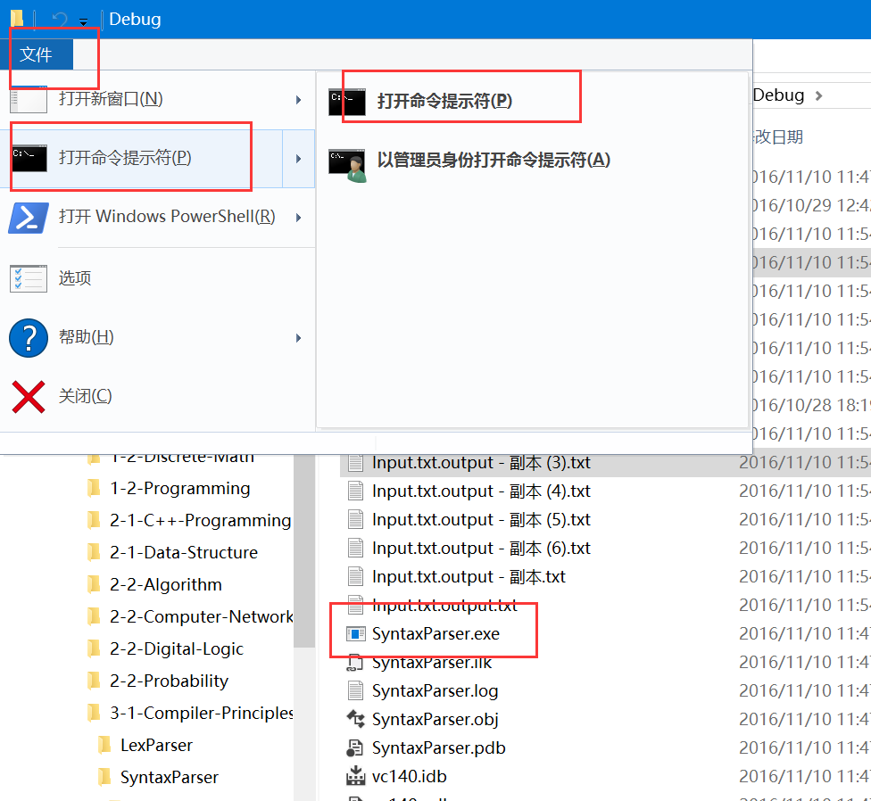
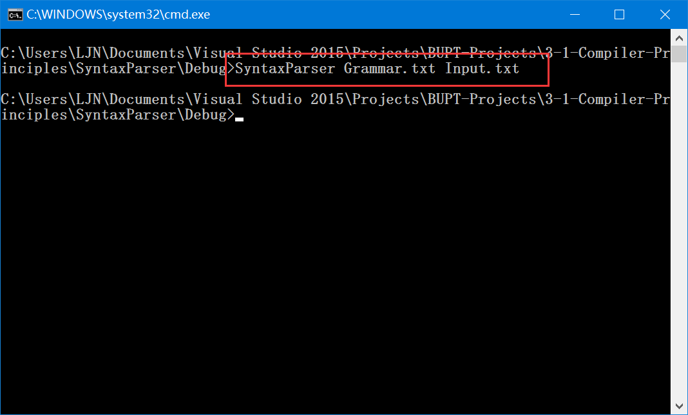
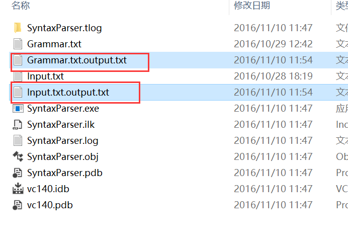

# 语法分析 - LL (1) 实验报告

> 2014211306 2014211288
> 李俊宁

> 2016/11/10

## 实验目的

1. 编程实现对算术表达式的语法分析程序
2. 理解并掌握语法分析程序

## 实验内容

实现如下文法的语法分析程序： 

```
E -> E + T | E - T | T
T -> T * F | T / F | F
F -> ( E ) | num
```

1. 实现**自动**构造LL(1)分析表
2. 实现LL(1)分析程序

## 算法设计

### Part 1

- 读入文法
- 消除左递归
  - 给定一个所有**非终结符**顺序，根据这个顺序**遍历**所有非终结符
    - 按顺序当前符号产生式中排在当前符号**前边**的非终结符用对应**产生式**代替
    - 所有**带左递归**产生式**替换**： `A -> A alpha => A' -> alpha A'`
    - 在所有产生式**尾部插入 A'**： `A -> beta => A -> beta A'`
    - **插入** `A' -> epsilon`
- 提取左因子
  - 遍历所有**非终结符的每个产生式**找出**公共前缀**
  - **替换** `A -> X alpha | X beta => _A -> alpha | beta`
  - 如果`alpha beta`有空，**插入** `_A -> epsilon`
  - **插入** `A -> X _A`
  - **循环**这个过程直到无左因子
- 构造LL(1)分析表
  - 找**First集**
    - Frist[终结符号] = { 终结符号 }
    - **遍历**每个产生式**每个符号**
      - First[产生式左端非终结符] += First[当前符号]
      - 如果First[当前符号]没有**epsilon**
        - **结束**遍历
      - 如果**全部遍历的**符号的First有**epsilon**
        - First[产生式左端非终结符] += { epsilon }
    - **循环**这个过程直到不再增加
  - 找**Follow集**
    - **遍历**每个产生式**每个符号**，跳过**终止符号**
      - 将下一个符号First集加入当前符号的Follow集
      - 如果下一个符号不存在 或 First[当前符号]有**epsilon**
        - Follow[当前符号] += Follow[产生式左端非终结符]
    - **循环**这个过程直到不再增加
  - 生成分析表
    - **遍历**First[每个产生式**右端第一个符号**]
      - 如果First[i]不为**epsilon**
        - **产生式** 加入 **分析表**[产生式左端非终结符, First[i]]
      - 否则，**遍历**Follow[产生式左端非终结符]
        - **产生式** 加入 **分析表**[产生式左端非终结符, Follow[i]]
    - 如果存在**多重表项**
      - 不是LL(1)文法，**报错**
  - 加入错误处理**sync**
    - **遍历**Follow[每一个非终结符]
      - 如果 **分析表**[非终结符, Follow[i]]为空
        - **sync** 加入 **分析表**[非终结符, Follow[i]]
- 打印文法
- 打印LL(1)分析表

### Part 2

- 读入待分析表达式集
- 分析表达式集
  - 切分表达式
  - 初始化分析器
    - 输入流尾部插入$
    - 分析栈压入 $ 和 起始符
  - 循环直到 栈空 或 输入读完
    - 如果栈顶是非终结符
      - 如果 分析表项 非空
        - 弹栈
        - 如果 分析表项 不为**sync**
          - 反向压入 分析表项，输出
        - 否则
          - 报错
      - 否则
        - 报错，后移指针
    - 如果栈顶是终止符号 或 $
      - 弹栈
      - 如果 栈顶 == 当前输入
        - 后移指针
        - 如果 栈顶 == 当前输入 == $
          - 退出循环
      - 否则
        - 报错
- 输出分析结果

## 架构设计

### SyntaxParser

函数成员：

- `Parse (istream, ostream)`  // 分析待分析表达式集

### Grammar

数据成员：

- `startSymbol`
- 集合: `nonTerminalSymbols`
- 集合: `terminalSymbols`
- 映射: `productionRules`
  - 非终结符 -> { 产生式 } = { { 符号 } }

函数成员：

- `FixLeftRecursion ()`  // 消除左递归
- `FixLeftCommonFactor ()`  // 提取左因子

### LL1Grammar : Grammar

数据成员：

- 继承 `Grammar` 成员
- 映射: `table`
  - (终结符, 非终结符) -> 产生式 = { { 符号 } }

函数成员：

- 继承 `Grammar` 成员
- `GetLL1Table ()`  // 生成LL(1)分析表

### LexParser

数据成员：

- 集合: `tokens`

函数成员：

- `LexParser (istream, puncSet)`
  - `istream` 待分析表达式输入流
  - `puncSet` 标点符号集合

## 输入输出

### `int main (int argc, char *argv[])`

- 检查`argc` 是否合法 (`argc >= 3`)
  - `argv[1]` 为语法定义文件
  - `argv[2]` 为待识别文件
- 打开输入/输出文件，并判断释放成功
- 将**语法定义文件输入流**传入`SyntaxParser`，生成语法分析器
- 将**语法输出流**用于打印**语法**及**LL(1)分析表**
- 将**待识别文件 输入/输出 流**传入`SyntaxParser.Parse`进行分析

### 输入格式

文件允许的换行符：
- Windows `\r\n`
- Linux `\n`

#### 语法定义文件

每个非终止符号的**所有推导**用**一行**列出，**各个产生式**用**管道线**隔开，
**各个符号**之间用**界符**隔开：

```
E -> E + T | E - T | T
```

- `->` 表示**推导运算**
- `|` 表示**管道线**
- ` ` （空格）表示符号间的**界符**
- `num` 表示**数字**
- `epsilon` 表示**空产生式**
- **其他符号** 表示文法的符号
  - 在 `->` 前出现的符号 为**非终止符号**
  - 所有符号除了非终止符号 为**终止符号**

#### 待识别文件

**行**为单位的**待分析表达式**

### 输出格式

#### 语法输出

- 去左递归后的语法
  - 开始符号
  - 非终结符号
  - 终结符号
  - 产生式列表
- LL(1)分析表

#### 待识别文件输出

每一个**待分析表达式**的 **最左推导/错误处理** 结果

## 运行样例

### Windows MSVC 2015 (Visual Studio 2015)

运行 `SyntaxParser.vcxproj`, 并使用参数 `Grammar.txt Input.txt`

也可以编译为 `SyntaxParser.exe` 之后

- 在该目录下，打开命令提示符

- 在命令提示符输入 `SyntaxParser Grammar.txt Input.txt`

- 在该目录下，得到输出文件


Remarks:

- Grammar.txt 为文法输入
- Input.txt 为表达式输入

### Unix/Unix-like

在终端中输入

``` bash
g++ SyntaxParser.cpp -std=c++11 -o SyntaxParser
./SyntaxParser Grammar.txt Input.txt
```

Remarks:

- Grammar.txt 为文法输入
- Input.txt 为表达式输入

### Input

#### Grammar.txt

```
E -> E + T | E - T | T
T -> T * F | T / F | F
F -> ( E ) | num
```

#### Input.txt

```
* (3.3 - 2) * + ( * + 2
(3.5/(2-4*.8/2)-2*3.+(2/(2)-2))+2
```

### Output

#### Grammar.txt.output.txt

```
Grammar:
Starting Symbol:
	E
Non Terminal Symbols:
	E T F E' T' 
Terminal Symbols:
	( ) num + - * epsilon / 
Production Rules:
	E -> T E'
	T -> F T'
	F -> ( E ) | num
	E' -> + T E' | - T E' | epsilon
	T' -> * F T' | / F T' | epsilon

LL1 Table:
<E, (>         E -> T E'
<T, (>         T -> F T'
<F, (>         F -> ( E )
<F, $>         F -> sync
<T, $>         T -> sync
<E, $>         E -> sync
<T', $>        T' -> epsilon
<E, num>       E -> T E'
<T, num>       T -> F T'
<F, num>       F -> num
<E', $>        E' -> epsilon
<F, +>         F -> sync
<T, +>         T -> sync
<T', +>        T' -> epsilon
<E', +>        E' -> + T E'
<F, ->         F -> sync
<T, ->         T -> sync
<T', ->        T' -> epsilon
<E', ->        E' -> - T E'
<F, )>         F -> sync
<T, )>         T -> sync
<E, )>         E -> sync
<T', )>        T' -> epsilon
<E', )>        E' -> epsilon
<F, *>         F -> sync
<T', *>        T' -> * F T'
<F, />         F -> sync
<T', />        T' -> / F T'
```

#### Input.txt.output.txt

```
Parse $* (3.3 - 2) * + ( * + 2$ :
Err: E | *              Skip *
E -> T E'
T -> F T'
F -> ( E )
E -> T E'
T -> F T'
F -> num
T' -> epsilon
E' -> - T E'
T -> F T'
F -> num
T' -> epsilon
E' -> epsilon
T' -> * F T'
Err: F | +               Pop F
T' -> epsilon
E' -> + T E'
T -> F T'
F -> ( E )
Err: E | *              Skip *
Err: E | +              Skip +
E -> T E'
T -> F T'
F -> num
T' -> epsilon
E' -> epsilon
Err: ) | $               Pop )
T' -> epsilon
E' -> epsilon

Parse $(3.5/(2-4*.8/2)-2*3.+(2/(2)-2))+2$ :
E -> T E'
T -> F T'
F -> ( E )
E -> T E'
T -> F T'
F -> num
T' -> / F T'
F -> ( E )
E -> T E'
T -> F T'
F -> num
T' -> epsilon
E' -> - T E'
T -> F T'
F -> num
T' -> * F T'
F -> num
T' -> / F T'
F -> num
T' -> epsilon
E' -> epsilon
T' -> epsilon
E' -> - T E'
T -> F T'
F -> num
T' -> * F T'
F -> num
T' -> epsilon
E' -> + T E'
T -> F T'
F -> ( E )
E -> T E'
T -> F T'
F -> num
T' -> / F T'
F -> ( E )
E -> T E'
T -> F T'
F -> num
T' -> epsilon
E' -> epsilon
T' -> epsilon
E' -> - T E'
T -> F T'
F -> num
T' -> epsilon
E' -> epsilon
T' -> epsilon
E' -> epsilon
T' -> epsilon
E' -> + T E'
T -> F T'
F -> num
T' -> epsilon
E' -> epsilon
```