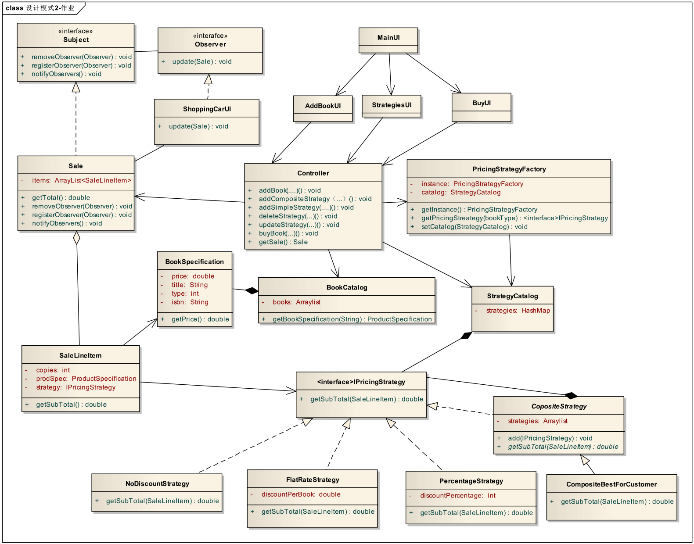

# 代码说明

主要设计参考了以下类图：

由于上图设计有些不足，实际设计中加以修改：

- `interface Observer` 中的 `update(Sale) : void` 修改为 `update() : void`
  - 若使用原设计，则 `interface Subject` 依赖于 `Observer`，而`Observer` 依赖的 `Sale implements Subject` 为 `Subject` 的一个实现；这将导致 `Subject` 无意义。
  - 实际设计中，通过 `controller` 传递 `Sale` 给 `ShoppingCartUI` （原图笔误为 `ShoppingCarUI`）。
- `interface IPricingStrategy` 中的 `getSubTotal(SaleLineItem) : double` 修改为 `getSubTotal(copies, bookSpecification) : double`
  - 若使用原设计，则 `interface IPricingStrategy` 依赖于 `SaleLineItem`，而 `SaleLineItem` 拥有 `IPricingStrategy` 实现的对象；计算价格时，`IPricingStrategy` 实现依赖于 `SaleLineItem` 的 `getCopies` `getBookSpecification`。
  - 实际设计中，通过直接传递 `copies, bookSpecification` 解除 `interface IPricingStrategy` 和 `SaleLineItem` 之间的**强耦合**。
- 合并了 `Controller` 中的 `addCompositeStrategy` `addSimpleStrategy` `updateStrategy`。
- 增加了 `BuyUI` 到 `ShoppingCartUI` 的关联（**Association**）
  - 原设计中没有导航到 `ShoppingCartUI` 的设计。
- 删去了 `CompositeBestForCustomer`
  - 原设计文档中没有提及该类。

其余部分基本**按照并扩展**原设计图。