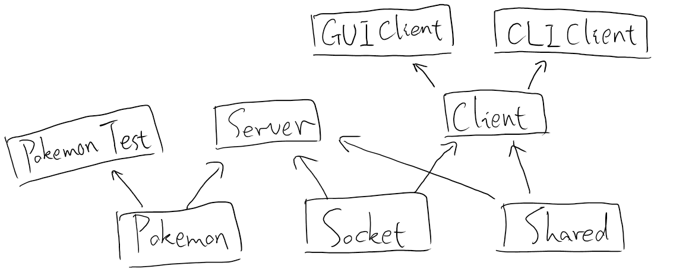

# 宠物小精灵对战游戏

> 2014211306 李俊宁 2014211288

- 参考
  *[CppCoreGuidelines](https://github.com/isocpp/CppCoreGuidelines)*，
  使用 **Modern C++** 编写；
- 设计 更好的数据库ORM和图形库：
  *[ORM Lite](https://github.com/BOT-Man-JL/ORM-Lite)* &
  *[EggAche GL](https://github.com/BOT-Man-JL/EggAche-GL)*；
- 使用 lambda 表达式 和 callback 方式，实现**低耦合 可扩展**的 C/S 设计；
- 使用 `unique_ptr` 和 reference方式，**消除**潜在的**内存泄露**；
- 使用 Template Method 和 virtual function，实现**可扩展**的**类设计**；
- 使用 **线程池 / 帧率控制技术 / 客户端预测技术** 渲染高性能画面；
- 使用 `exception` 实现灵活的**错误处理**；
- 使用 `json` 提高**协议**的**可扩展性**；

## 需求

### 题目一：宠物小精灵的加入

> 设计宠物小精灵的类，为简化游戏设计，精灵的属性包括种类（力量型：高攻击； 肉盾型：高生命值； 防御型：高防御； 敏捷型：低攻击间隔，共四种）、名字、等级、经验值、攻击力、防御力、生命值、攻击间隔等（以上属性必须，其他属性可自行添加）（基本要求：本游戏中只有上面的4种类型。 进一步要求：上述4种类型可以进一步深入划分，比如力量型又可以在细分为：沙瓦朗、火爆猴、腕力等）
>
> 每个精灵初始等级为1，满级15级，每当精灵升级的时候，宠物对应的属性值会有少量增加（主属性增加量相对较多）
>
> 每个精灵有自己独特的攻击方式，如“闪电攻击”，“火焰攻击”等等，请设计一个精灵的基类，并将精灵的攻击方法设为虚方法以方便子类重写
>
> 请写一个测试程序对设计的精灵类的相关属性和方法（包括攻击函数，升级函数等）进行测试
>
> 题目考察点：类的继承，对象数据成员设计，成员函数设计

项目文件：

- Pokemon.h
- Pokemon.cpp
- TestPokemon.cpp（测试）

### 题目二：用户注册与平台登录

> 每个用户需要注册一个账号，用户名全局唯一，不能有任何两个用户名相同，要考虑注册失败的场景时的反馈
>
> 实现注册、登录、登出功能，均采用C/S模式，客户端和服务端用socket进行通信，服务端保存所有用户的信息（文件存储或数据库均可，数据库有额外加分）
>
> 每个用户拥有：用户名、拥有的精灵，两个属性。 用户注册成功时，系统自动随机分发三个1级精灵给用户
>
> 用户可以查看所有成功注册用户拥有的精灵，也可以查看所有当前在线的用户
>
> 如有界面设计可酌情加分
>
> 题目考察点：socket通信，交互场景反馈

项目依赖：

- *[ORM Lite](https://github.com/BOT-Man-JL/ORM-Lite)* (Server Only)
- *[json](https://github.com/nlohmann/json)*

项目文件：

- Socket.h
- Shared.h
- Server
  - Pokemon.h
  - Pokemon.cpp
  - Server.h
  - Server.cpp
- Client
  - Pokemon.h
  - Client.h
  - TestClient.cpp（测试）

### 题目三：游戏对战的设计

> 已经登录的在线用户可以和服务器进行虚拟决斗，决斗分两种：升级赛和决斗赛，两种比赛都能增长宠物经验值。服务器上有一个虚拟精灵的列表，用户可以挑选其中任意一个进行比赛（升级赛或者决斗赛）。另外决斗赛中用户胜出可以直接获得该战胜的的精灵，失败则系统从用户的精灵中随机选三个（不够三个精灵的情况就选择他所有的精灵），然后由用户选一个送出。
> > 升级赛 只是用户用来增加精灵经验值，规则开发者自定；
> >
> > 累积多少经验值升一级，规则开发者自定；
> >
> > 决斗赛的上述规则同升级赛，只是额外还可以赢得宠物一个。
>
> 请让你的系统自动模拟每场比赛的每次出招。另外，为了增加不确定性，可以加入概率闪避攻击和暴击伤害机制
> > 比赛的过程和结果由系统根据上述规则自动模拟完成，要求结果具有一定的随机性。

（以上内容以替换为**多人实时对战**）

> 用户如果没有精灵（比如总是失败，已经全部送出去），则系统会随机放给给他一个初级精灵。
>
> 用户增加新功能，可以查看某个用户的胜率
>
> 用户增加新属性，为宠物个数徽章（金银铜）和高级宠物徽章（金银铜），分别根据拥有的宠物个数的多少和拥有高级宠物（15级）个数的多少颁发
>
> 如有界面设计可酌情加分，如有新颖设计可酌情加分
>
> 题目考察点：客户端与服务器数据交互（可采用多进程或异步通信或其他方法均可），并发请求处理，类的方法设计，伤害计算方法设计。

项目依赖：

- *[ORM Lite](https://github.com/BOT-Man-JL/ORM-Lite)* (Server Only)
- *[EggAche GL](https://github.com/BOT-Man-JL/EggAche-GL)* (Client Only)
- *[json](https://github.com/nlohmann/json)*

项目文件：

- Socket.h
- Shared.h
- Server
  - Pokemon.h
  - Pokemon.cpp
  - Server.h
  - Server.cpp
- Client
  - Pokemon.h
  - Client.h
  - GUIClient.h
  - GUIClient.cpp

## 业务

### 操作原语

- 保证所有操作为 `transaction`；
- 账户管理
  - 注册
  - 登录
  - 登出
- 查询
  - 查询用户
  - 查询小精灵
- 房间
  - 查询房间
  - 进入房间
  - 离开房间
- 游戏
  - 房间内玩家状态
  - 游戏状态

### 传输协议

- 使用 `json` 交换信息；
- 使用 `stateless` 传输方式；
- 使用 `session` 保持状态；
- 不规定包长度，以 `0` 结尾；

``` json
"user":
{
  "uid": uid, "online": isonline, "wonrate": wonrate,
  "badges": [badge], "pokemons": [pokemon]
}

"pokemon":
{
  "pid": pid, "uid": uid, "name": name,
  "level": level, "exppoint": exppoint,
  "atk": atk, "def": def, "hp": hp, "timegap": timegap
}

"room":
{
  "rid": rid,
  "pending": not_over_and_not_started
}

"roomplayer":
{
  "uid": uid, "ready": isready,
  "width": width, "height": height,
  "pokemon": pokemon
}

"gameplayer":
{
  "uid": uid,
  "x": x, "y": y,
  "vx": vx, "vy": vy,
  "timegap": timegap,
  "hp": curHp
}

"gamedamage":
{
  "did": did,
  "x": x, "y": y,
  "vx": vx, "vy": vy
}

"resultplayer":
{
  "uid": uid,
  "won": iswon
}
```

#### 账户管理

``` json
// register

{"request": "register", "param": {"uid": uid, "pwd": pwd}}

{"success": true, "response": msg}
{"success": false, "response": msg}

// login

{"request": "login", "param": {"uid": uid, "pwd": pwd}}

{"success": true, "response": {"sid": sid, "user": thisuser}
{"success": false, "response": msg}

// logout

{"request": "logout", "param": {"sid": sid}}

{"success": true, "response": msg}
{"success": false, "response": msg}

// sesseion error

{"success": false, "response": "You haven't Login"}
```

#### 查询

``` json
// pokemons

{"request": "pokemons", "param": {"sid": sid}}

{"success": true, "response": [pokemon]}
{"success": false, "response": msg}

// users

{"request": "users", "param": {"sid": sid}}

{"success": true, "response": [user]}
{"success": false, "response": msg}
```

#### 房间 / 游戏

``` json
// rooms

{"request": "rooms", "param": {"sid": sid}}

{"success": true, "response": [rid]}
{"success": false, "response": msg}

// roomenter

{"request": "roomenter",
 "param": {"sid": sid, "rid": rid, "pid": pid}}

{"success": true, "response": {"width": width, "height": height}}
{"success": false, "response": msg}

// roomleave

{"request": "roomleave", "param": {"sid": sid}}

{"success": true, "response": msg}
{"success": false, "response": msg}

// roomready

{"request": "roomready",
 "param": {"sid": sid, "ready": isready}}

{"success": true, "response": [roomplayer]}
{"success": false, "response": msg}

// gamesync

{ "request": "gamesync",
  "param": {
    "sid": sid,
    "movex": movex, "movey": movey,
    "atkx": atkx, "atky": atky,
    "def": isdef
  }
}

{
  "success": true,
  "response": {
    "over": isover,
    "gameplayers": [gameplayer],     // not over
    "gamedamages": [gamedamage],     // not over
    "resultplayers": [resultplayer]  // over
  }
}
{"success": false, "response": msg}
```

## 设计



### `BOT_Socket::Server` (Socket.h)

#### `Server::Server`

``` cpp
Server (unsigned short port,
        std::function<void (const std::string &request,
                            std::string &response)> callback);
```

参数：
- `port` 为监听端口，默认监听所有 IP；
- `callback` 为处理业务逻辑的**回调函数**；

异常：
- 建立 Server 失败，抛出 `runtime_error`；

功能：
- 构造一个 Socket Server，为每一个 accept 的 socket 建立新的线程；
- 每个线程的每个请求 `request`，调用回调函数处理；
- 传给回调函数 `request`，并将回调函数写入的 `response` 发回给客户端；
- 当连接断开后，结束对应的线程；
- 实现 `recv` 时，使用 `stringstream` 进行**动态buffer**接收；

### `BOT_Socket::Client` (Socket.h)

#### `Client::Client`

``` cpp
Client (const std::string &ipAddr,
        unsigned short port);
```

参数：
- `ipAddr` 为服务器 IP；
- `port` 为服务器端口；

异常：
- 建立 Client 失败，抛出 `runtime_error`；

功能：
- 构造一个 Socket Client，连接到服务器的对应主机端口上；

#### `Client::~Client`

``` cpp
Client::~Client ();
```

功能：
- 断开 `this` 连接的 socket；

#### `Client::Request`

``` cpp
std::string Client::Request (const std::string &request);
```

参数：
- `request` 发给 Server 的 string；

返回值：
- Server 响应该请求时返回的 string；

异常：
- Server 关闭连接 / 发送失败，抛出 `runtime_error`；

功能：
- 使用 `this` 连接的 socket 进行数据收发；
- 实现 `recv` 时，使用 `stringstream` 进行**动态buffer**接收；

### `Shared` （Shared.h)

``` cpp
namespace PokemonGame
{
    using PokemonID = size_t;
    using PokemonName = std::string;

    using UserID = std::string;
    using UserPwd = std::string;
    using UserBadge = std::string;

    using SessionID = std::string;
    using RoomID = std::string;

    constexpr const char *BadSession = "You haven't Login";
}
```

- 定义所有 server 和 client 共享数据的**格式**；
- 定义**被迫掉线**时 server 的返回消息；

### `PokemonGame::Pokemon` (Pokemon.h/cpp)

Pokemon 抽象类；

#### `Pokemon::Level/ExpPoint/HealthPoint/TimeGap`

``` cpp
using Level = unsigned;
using ExpPoint = unsigned;
using HealthPoint = unsigned;
using TimeGap = unsigned;
```

#### `Pokemon::PokemonNames`

``` cpp
static const std::vector<std::string> &PokemonNames ();
```

返回值：
- 所有存在的小精灵的名字列表；
- 可以用于随机产生小精灵；

#### `Pokemon::NewPokemon`

``` cpp
static std::unique_ptr<Pokemon> NewPokemon ();
static std::unique_ptr<Pokemon> NewPokemon (
    const std::string &name);
static std::unique_ptr<Pokemon> NewPokemon (
    const std::string &name,
    Level level,
    ExpPoint expPoint,
    HealthPoint atk,
    HealthPoint def,
    HealthPoint hp,
    TimeGap timeGap);
```

参数：
- `name` 为小精灵的名字；
- `level` 为小精灵的等级；
- `expPoint` 为小精灵的经验；
- `atk` 为小精灵的攻击力；
- `def` 为小精灵的防御力；
- `hp` 为小精灵的生命值；
- `timeGap` 为小精灵的攻击间隔；

返回值：
- 生成的小精灵的对象，使用 `unique_ptr` 标识所有权；
- 第一个函数随机产生一个小精灵；
- 第二个函数根据名字随机产生一个小精灵；
- 第三个函数根据名字/属性构造一个小精灵；

异常：
- 第二第三个函数，小精灵名字不存在，抛出 `runtime_error`；

功能：
- 作为**精灵工厂**，构造小精灵子类的对象；
- 使用 `unique_ptr` 避免潜在的内存泄露；
- 在 `Pokemon.cpp` 中使用宏展开代码：

``` cpp
#define SCAFFOLD_NEW_POKEMON_FROM_NAME_WITH_ATTR(CLASSNAME)
#define SCAFFOLD_NEW_POKEMON_FROM_NAME(CLASSNAME)
```

#### `Pokemon::GetType/GetName/GetSize/GetVelocity`

``` cpp
// Get Type & Name
virtual std::string GetType () const = 0;
virtual std::string GetName () const = 0;

// Get Physics
virtual std::pair<size_t, size_t> GetSize () const = 0;
virtual size_t GetVelocity () const = 0;
```

返回值：
- 小精灵的类型/名字的 string；
- 小精灵的宽度/高度；
- 小精灵的移动速度；
- 虚函数，根据不同对象返回不同的属性；

#### `Pokemon::Get*`

``` cpp
Level GetLevel () const;
Level GetExp () const;
HealthPoint GetAtk () const;
HealthPoint GetDef () const;
TimeGap GetTimeGap () const;
HealthPoint GetHP () const;
HealthPoint GetCurHP () const;
```

返回值：
- 小精灵的等级/经验/攻击力/防御力/攻击间隔/生命值/剩余生命值；
- 非虚函数，返回对象的属性值；

#### `Pokemon::Attack`

``` cpp
std::pair<bool, bool> Attack (Pokemon &opPokemon);
```

参数：
- `opPokemon` 为被攻击的小精灵；

返回值：
- `first` 是否杀死对方小精灵；
- `second` 是否升级；

功能：
- 使用 **Template Method Pattern**，提高可扩展性；
- 通过重载 `_GetDamagePoint` 和 `_OnUpgrade` 实现具体的伤害计算和升级；

#### `Pokemon::Recover`

``` cpp
void Recover ();
```

功能：
- 恢复当前小精灵的生命值；

### `PokemonGame::*Pokemon` (Pokemon.h/cpp)

Pokemon 种类的半抽象类；

``` cpp
#define SCAFFOLD_POKEMON_TYPE(CLASSNAME)

// Scaffold 4 Types of Pokemons
SCAFFOLD_POKEMON_TYPE (StrengthPokemon);
SCAFFOLD_POKEMON_TYPE (DefendingPokemon);
SCAFFOLD_POKEMON_TYPE (TankPokemon);
SCAFFOLD_POKEMON_TYPE (SwiftPokemon);
...
```

- 重写虚函数 `GetType`，返回 `#CLASSNAME`；
- 重写虚函数 `_GetDamagePoint`，根据对手小精灵种类，返回伤害值；
- `_GetDamagePoint` 中，使用 `dynamic_cast` 判断对手小精灵种类；

### `PokemonGame::*Pokemon` (Pokemon.h/cpp)

Pokemon 对象子类；

``` cpp
#define SCAFFOLD_POKEMON(
    CLASSNAME, TYPE, W, H, V, ATK, DEF, HP, TG)

// Scaffold Pokemons
SCAFFOLD_POKEMON (Pikachu, SwiftPokemon,
                  10, 20, 20,
                  10, 7, 45, 4);
SCAFFOLD_POKEMON (Charmander, StrengthPokemon,
                  20, 25, 14,
                  15, 7, 55, 6);
...
```

- 重写虚函数 `GetName`，返回 `#CLASSNAME`；
- 重写虚函数 `GetSize`/`GetVelocity`，返回 `W, H / V`；
- 重写虚函数 `_OnUpgrade`，个性化每个小精灵升级的属性提升；

### `PokemonGame::Server` (Server.h)

- 依赖于 `ORM Lite` `json`；
- 实现实际的服务器业务逻辑；

#### Server-side Model

数据库模型：

- `struct PokemonModel` 定义用于**持久化**的 `Pokemon` 数据模型；
  - `PokemonModel::ToPokemon` 从 `PokemonModel` 生成 `Pokemon`；
  - `PokemonModel::FromPokemon` 从 `Pokemon` 生成 `PokemonModel`；
- `struct BadgeModel` 定义用于**持久化**的 Badge 数据模型；
- `struct UserModel` 定义用于**持久化**的 User 数据模型；
  - 每个 User 有多个 Badge 和 Pokemon，形成一对多关系；

运行时模型：

- `TimePoint/TimePointHelper` 定义时间相关的 数据类型；
- `struct SessionModel` 定义 会话 模型；
- `struct RoomModel` 定义 房间/游戏时 模型；
  - `struct RoomModel::Player` 定义 玩家 模型；
  - `struct RoomModel::Damage` 定义 伤害 模型；
  - `struct RoomModel::RigidBody` 定义 刚体 模型；
    - `RigidBody::IsOverlap` 判断两个刚体是否重叠；
    - `RigidBody::IsInside` 判断刚体是否包含于另一个刚体；

#### `Server::Server`

``` cpp
Server (unsigned short port);
```

参数：
- `port` 为监听端口，用于构造 `BOT_Socket::Server`；

功能：
- 启动处理业务逻辑的服务器；

实现细节：
- 启动流程：
  - 初始化 `SessionModel` 和 `RoomModel` 列表；
  - 初始化数据库；
  - 注册各个业务的 `Handler`；
  - 运行一个 `BOT_Socket::Server` 实例
  - 根据业务逻辑，通过回调，将消息分发到不同的 `Handler`；
- 数据库使用 `ORM Lite`，实现 对象-关系 映射；
- 使用 lambda 表达式，实现局部性函数定义；
- `Handler` 定义为
  `std::function<void (json &response, const json &request)>`，
  将客户端 请求 转为 json 的 `request` 传给回调函数，
  把 `response` 转化为 响应，传给客户端；
- `Handler` 回调函数通过 `throw exception` 进行**错误处理**；
- `SetHandler` 注册业务逻辑回调函数，放入
  `std::unordered_map<std::string, Handler>` 中，实现**高可复用**；

### `Server main` (Server.cpp)

- 启动一个 `PokemonGame::Server` 的实例；

### `PokemonGame::Client` (Client.h)

- 依赖于 `json`；
- 实现客户端对 协议 的封装；

#### Client-side Model

- `struct PokemonModel` 定义 `Pokemon` 数据模型；
- `struct UserModel` 定义 `User` 数据模型；
  - 包含了 `User` 的 `Badges` 和 `Pokemons`；
- `struct RoomModel` 定义 房间 数据模型；
- `struct RoomPlayer` 定义 房间内玩家 数据模型；
- `struct GameModel` 定义 游戏状态 数据模型；
  - `struct GamePlayer` 定义 游戏时玩家 模型；
  - `struct GameDamage` 定义 游戏时伤害 模型；
  - `struct ResultPlayer` 定义 游戏结束后结果 模型；
  - `bool isOver` 判断 游戏是否结束；

#### `Client::Client`

``` cpp
Client (const std::string &ipAddr,
        unsigned short port);
```

参数：
- `ipAddr` 为服务器 IP；
- `port` 为服务器端口；

异常：
- 建立 `BOT_Socket::Client` 失败，抛出 `runtime_error`；

功能：
- 构造一个 `BOT_Socket::Client`；

#### `Client::Register`

``` cpp
std::string Register (const UserID &uid,
                      const UserPwd &pwd);
```

参数：
- `uid` 为用户名；
- `pwd` 为用户密码；

返回值：
- 成功消息；

异常：
- 发送失败 / 服务器返回错误信息，抛出 `runtime_error`；

功能：
- 根据用户名/密码，注册用户；

#### `Client::Login`

``` cpp
UserModel Login (const UserID &uid,
                 const UserPwd &pwd);
```

参数：
- `uid` 为用户名；
- `pwd` 为用户密码；

返回值：
- 当前用户的用户模型；

异常：
- 发送失败 / 服务器返回错误信息，抛出 `runtime_error`；

功能：
- 根据用户名/密码，登录用户；
- 使用服务器返回的 `session` 标识当前 `Client` 的登录状态；

#### `Client::Logout`

``` cpp
std::string Logout ();
```

返回值：
- 成功消息；

异常：
- 发送失败 / 服务器返回错误信息，抛出 `runtime_error`；

功能：
- 登出当前 `Client`；

#### `Client::Pokemons`

``` cpp
std::vector<PokemonModel> Pokemons ();
```

返回值：
- 所有存在的小精灵模型；

异常：
- 发送失败 / 服务器返回错误信息，抛出 `runtime_error`；

功能：
- 查询当前所有用户的所有小精灵；

#### `Client::Users`

``` cpp
std::vector<UserModel> Users ();
```

返回值：
- 所有用户的模型；

异常：
- 发送失败 / 服务器返回错误信息，抛出 `runtime_error`；

功能：
- 查询当前所有用户；

#### `Client::Rooms`

``` cpp
std::vector<RoomModel> Rooms ();
```

返回值：
- 所有有效房间的模型；

异常：
- 发送失败 / 服务器返回错误信息，抛出 `runtime_error`；

功能：
- 查询当前所有房间；

#### `Client::RoomEnter`

``` cpp
std::pair<size_t, size_t> RoomEnter (const RoomID &rid,
                                     const PokemonID &pid);
```

参数：
- `rid` 为要进入房间的 ID；
- `pid` 为用于战斗的小精灵的 ID；

返回值：
- 进入的房间地图的大小；

异常：
- 发送失败 / 服务器返回错误信息，抛出 `runtime_error`；

功能：
- 使用一个小精灵进入一个房间；

#### `Client::RoomLeave`

``` cpp
std::string RoomLeave ();
```

返回值：
- 成功消息；

异常：
- 发送失败 / 服务器返回错误信息，抛出 `runtime_error`；

功能：
- 离开进入的房间；

#### `Client::RoomReady`

``` cpp
std::vector<RoomPlayer> RoomReady (bool isReady);
```

参数：
- `isReady` 为是否准备完成；

返回值：
- 房间内所有玩家模型；

异常：
- 发送失败 / 服务器返回错误信息，抛出 `runtime_error`；

功能：
- 标记当前玩家是否准备完成；
- 查询房间内所有玩家的状态；

#### `Client::GameSync`

``` cpp
GameModel GameSync (
    const int movex, const int movey,
    const int atkx, const int atky, const bool isDef);
```

参数：
- `movex` 为移动的 x 方向速度；
- `movey` 为移动的 y 方向速度；
- `atkx` 为攻击的 x 方向速度；
- `atky` 为攻击的 y 方向速度；
- `isDef` 为是否防御；

返回值：
- 当前游戏状态；

异常：
- 发送失败 / 服务器返回错误信息，抛出 `runtime_error`；

功能：
- 同步当前玩家的状态；
- 获取当前游戏的状态；

### `PokemonGameGUI::GUIClient` (GUIClient.h)

- 依赖于 `EggAche`；
- 使用 GUI，实现实际的客户端业务逻辑；
- 支持 鼠标 或 键盘 完全控制；

#### `GUIClient::LoginWindow`

``` cpp
static PokemonGame::UserModel LoginWindow (
    PokemonGame::Client &client,
    bool isPassiveOffline,
    size_t width = 480, size_t height = 360);
```

参数：
- `client` 为传入的 `PokemonGame::Client`；
- `isPassiveOffline` 为是否之前被迫掉线；
- `width` `height` 为窗口尺寸；

返回值：
- 当前用户的用户模型；

异常：
- 主动关闭了窗口，抛出 `runtime_error`；

功能：
- 使用 GUI 封装 `PokemonGame::Client` 的 `Login` / `Register`；
- 提示是否之前被迫掉线；

#### `GUIClient::StartWindow`

``` cpp
static std::pair<size_t, PokemonGame::PokemonID> StartWindow (
    const PokemonGame::UserModel &curUser,
    size_t width = 640, size_t height = 720);
```

参数：
- `curUser` 为当前用户的用户模型；
- `width` `height` 为窗口尺寸；

返回值：
- `first` 为导航到下一页标号；
  - `0` 为到 Room Window；
  - `1` 为到 Users Window；
  - `2` 为到 Poekmons Window；
- `second` 为到 Room Window 时，选择的小精灵 ID；

异常：
- 主动关闭了窗口 / 被迫掉线，抛出 `runtime_error`；

功能：
- 实现开始界面，让用户选择功能；

#### `GUIClient::UsersWindow / PokemonsWindow`

``` cpp
static void UsersWindow (PokemonGame::Client &client);

static void PokemonsWindow (PokemonGame::Client &client);
```

参数：
- `client` 为传入的 `PokemonGame::Client`；

功能：
- 使用 GUI 封装 `PokemonGame::Client` 的 `Users` / `Pokemons`；

#### `GUIClient::RoomWindow`

``` cpp
static std::pair<
    std::pair<size_t, size_t>,
    std::vector<PokemonGame::RoomPlayer>
> RoomWindow (
    PokemonGame::Client &client,
    const PokemonGame::UserModel &curUser,
    const PokemonGame::PokemonID &pidToPlay,
    size_t width = 640, size_t height = 640);
```

参数：
- `client` 为传入的 `PokemonGame::Client`；
- `curUser` 为当前用户的用户模型；
- `pidToPlay` 为选择进入房间的小精灵 ID；
- `width` `height` 为窗口尺寸；

返回值：
- `first` 为进入的房间地图大小；
- `second` 为房间内所有玩家模型；

异常：
- 主动关闭了窗口 / 被迫掉线，抛出 `runtime_error`；

功能：
- 使用 GUI 封装 `PokemonGame::Client` 的 `Room*`；
- 进入房间；

#### `GUIClient::GameWindow`

``` cpp
static std::vector<PokemonGame::GameModel::ResultPlayer>
GameWindow (
    PokemonGame::Client &client,
    const PokemonGame::UserModel &curUser,
    const std::vector<PokemonGame::RoomPlayer> &roomPlayers,
    size_t worldW, size_t worldH,
    size_t width = 640, size_t height = 480);
```

参数：
- `client` 为传入的 `PokemonGame::Client`；
- `curUser` 为当前用户的用户模型；
- `roomPlayers` 为房间内所有玩家模型；
- `worldW` `worldH` 为进入的房间地图大小；
- `width` `height` 为窗口尺寸；

返回值：
- 玩家结果列表；

异常：
- 主动关闭了窗口 / 被迫掉线，抛出 `runtime_error`；

功能：
- 使用 GUI 封装 `PokemonGame::Client` 的 `GameSync`；
- 进行游戏；
- 使用**帧率控制**，锁定帧率为30fps；
- 使用 `std::async` 线程池，将**同步帧插入渲染帧**，高效同步；
- 使用 **Client-side Prediction**，渲染平滑画面；

#### `GUIClient::ResultWindow`

``` cpp
static void ResultWindow (const std::vector<PokemonGame::
    GameModel::ResultPlayer> &results);
```

参数：
- `results` 为玩家结果列表；

功能：
- 显示游戏结果；

### `Client main` (GUIClient.cpp)

- 使用 `enum class GUIState` 状态机，进行界面之间的导航；
- 在对应的状态，打开对应界面，根据返回值或异常判断如何导航；

#### 状态机

初始状态为 Login；

- `GUIState::Quit`
  - 退出游戏
- `GUIState::Login`
  - 登陆成功 -> `Start`
  - 关闭窗口 -> `Quit`
- `GUIState::Start`
  - 查看用户 -> `Users`
  - 查看小精灵 -> `Pokemons`
  - 选择小精灵 -> `Rooms`
  - 被迫下线 -> `Login`
  - 关闭窗口 -> `Login`
- `GUIState::Users`
  - 关闭窗口 -> `Start`
- `GUIState::Pokemons`
  - 关闭窗口 -> `Start`
- `GUIState::Rooms`
  - 进入游戏 -> `Game`
  - 被迫下线 -> `Login`
  - 关闭窗口 -> `Start`
- `GUIState::Game`
  - 游戏结束 -> `GameResult`
  - 被迫下线 -> `Login`
  - 关闭窗口 -> `Start`
- `GUIState::GameResult`
  - 关闭窗口 -> `Start`

## 设计 `ORM Lite` `EggAche`

- *[ORM Lite](https://github.com/BOT-Man-JL/ORM-Lite)*
- *[EggAche GL](https://github.com/BOT-Man-JL/EggAche-GL)*