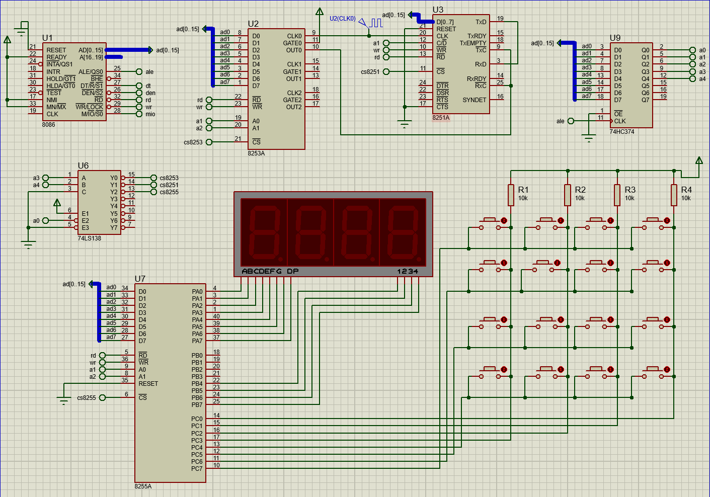

# 微机系统与接口技术 课程设计报告

> 2017/7/13
>
> by BOT Man

[heading-numbering]

## [no-toc] [no-number] 目录

[TOC]

## 实验目的

1. 进一步加深和巩固对所学知识点的理解和掌握；
2. 综合运用所学知识、工程原理来分析和完成本课程设计；
3. 理解计算机软件、硬件如何配合工作，能对计算机硬件进行功能扩展；
4. 掌握接口电路设计过程和驱动程序的编写方法；
5. 学会如何区分系统中软件、硬件故障和调试手段；
6. 培养计算机软硬件的综合设计能力和调试能力。

## 实验内容

### 硬件部分（用 Proteus 完成电路设计）

- 4x4 小键盘接口设计（利用 8255 C 口）
- 异步串行通信接口设计（8254 为波特率发生器）
- 4 位数码管显示器设计

### 软件部分（在 Proteus 环境下编程）

- 键盘扫描程序。将按键 0 ~ F 转换成 0 ~ 15 的二进制值；
- 串行接口通信程序。
  1. 发送 / 接收均为查询方式；
  2. 发送为查询方式 / 接收采用中断方式；
- 4 位七段数码管显示程序。左移位方式显示 0 ~ 9, A ~ F；
- 将串行接口发送端和接收端环回，当在 4x4 小键盘上敲击按键时，经串口发送、接收后将对应键值显示在 4 位数码管上。（要求：依次敲击 1, 2, 3, 4, 5 ... ，则依次显示 xxx1, xx12, x123, 1234, 2345 ...)

## 实验原理

### 使用的模块

- 8086（CPU）
- 8253A（定时）
- 8251A（串口）
- 74HC374（地址所存）
- 74LS183（地址译码）
- 8255A（并口）
- 7SEG-MPX4-CC（LED 显示）

### 实验原理图

[align-center]



## 实验程序

``` asm
;====================================================================
; Created by: BOT Man
; Processor: 8086
; Compiler: MASM32
;
; Before starting simulation set Internal Memory Size 
; in the 8086 model properties to 0x10000
;====================================================================

; Only use even-addressed memory,
; hence just care about AD[0..7] address
; (avoid using AD[8..15])

PORT82530   EQU 00H
PORT8253T   EQU 06H

PORT8251D   EQU 08H
PORT8251T   EQU 0AH

PORT8255A   EQU 10H
PORT8255B   EQU 12H
PORT8255C   EQU 14H
PORT8255T   EQU 16H

CODE    SEGMENT PUBLIC 'CODE'
        ASSUME CS:CODE,DS:DATA,SS:STACK

; In: none
; Out: none
DELAY   PROC NEAR
        PUSH CX
        MOV  CX,50H 
DELAYWAIT:
        LOOP DELAYWAIT
        POP  CX
        RET
DELAY   ENDP

; In: CX (position in BUFFER / SCANTABLE)
; Out: none
DISPLAY PROC NEAR
        PUSH AX
        PUSH BX
        PUSH CX
        PUSH DX

        ; Clear bit flag
        MOV  DX, PORT8255B
        IN   AL, DX
        OR   AL, 0F0H
        OUT  DX, AL

        ; Set BUFFER[CX] to Port A
        MOV  BX, OFFSET BUFFER
        ADD  BX, CX
        MOV  AL, [BX]
        MOV  DX, PORT8255A
        OUT  DX, AL

        ; Get bit flag mask to SCANTABLE[CX]
        MOV  BX, OFFSET SCANTABLE
        ADD  BX, CX
        MOV  CL, [BX]

        ; Set bit flag with mask
        MOV  DX, PORT8255B
        IN   AL, DX
        AND  AL, 0FH
        OR   AL, CL
        OUT  DX, AL
        CALL DELAY

        POP  DX
        POP  CX
        POP  BX
        POP  AX
        RET
DISPLAY ENDP

; Main Function
START:
        MOV  AX, DATA
        MOV  DS, AX
        
        ; Init 8253
        MOV  DX, PORT8253T
        MOV  AL, 00010110B        ; Timer-0 (00), Lower-Byte (01), Way3-SquareWave (011), Binary (0)
        OUT  DX, AL

        MOV  DX, PORT82530
        MOV  AL, 52               ; 时钟 1MHz, 波特率 1200baud, 波特率因子 16 (52)
        OUT  DX, AL

        ; Init 8251
        MOV  DX, PORT8251T

        XOR  AL, AL               ; Init to 0 for 3 times
        OUT  DX, AL
        OUT  DX, AL
        OUT  DX, AL

        MOV  AL, 01000000B        ; Work Command: Reset
        OUT  DX, AL
        NOP

        MOV  AL, 01001110B        ; Way Command: 1-bit-Stop (01), No-Parity (00), 8-bit-Data (11), async-with-baud-factor-16 (10)
        OUT  DX, AL
        NOP

        MOV  AL, 00100111B        ; Work Command: RTS, DTR, RxEn, TxEn (1)
        OUT  DX, AL
        NOP
        
        ; Init 8255
        MOV  DX, PORT8255T
        MOV  AL, 10000001B        ; Way Command: (1), A-Way0 (00), A-Out (0), C-Higher-Out (0), B-Way0 (0), B-Out (0), C-Lower-In (1)
        OUT  DX, AL

        ; Clear READY flag
        MOV  READY, 00H

GETKEY:
        MOV  CX, 00H              ; Line Number
CHECKLINE:
        MOV  BX, OFFSET SCANTABLE
        ADD  BX, CX
        MOV  AL, [BX]
        MOV  DX, PORT8255C
        OUT  DX, AL

        ; Check again
        IN   AL, DX               ; 判断是否有键盘按下
        MOV  AH, AL
        CALL DELAY                ; 延迟一段时间，避过抖动区间
        IN   AL, DX               ; 延时后再次读入
        CMP  AL, AH               ; 比较两次读入的值
        JNZ  CHECKLINE            ; 不相等说明为抖动，重新检测

        AND  AL, 0FH
NEXT1:
        CMP  AL, 0EH              ; column 3
        JNZ  NEXT2
        MOV  BX, 03H
        JMP  PARSE
NEXT2:
        CMP  AL, 0DH              ; column 2
        JNZ  NEXT3
        MOV  BX, 02H
        JMP  PARSE
NEXT3:
        CMP  AL, 0BH              ; column 1
        JNZ  NEXT4
        MOV  BX, 01H
        JMP  PARSE
NEXT4:
        CMP  AL, 07H              ; column 0
        JNZ  NEXTROUND
        MOV  BX, 00H
        JMP  PARSE

NEXTROUND:
        INC  CX                   ; next line
        CMP  CX, 04H              ; has checked 4 lines?
        JNZ  CHECKLINE
        JMP  KEYDONE

PARSE:
        MOV  AL, CL               ; CL = row; AL = row
        MOV  DL, 04H
        MUL  DL
        ADD  BL, AL               ; BL = col; BL = row * 4 + col
        
        ; Wait for pop up
        MOV  DX, PORT8255C
        IN   AL, DX
        MOV  AH, AL
NOTUP:
        CALL DELAY
        IN   AL, DX
        CMP  AL, AH
        JZ   NOTUP

        ; Set READY flag
        MOV  READY, 01H

KEYDONE:
        ; Update Display
        MOV  CX, 3
        CALL DISPLAY
        MOV  CX, 2
        CALL DISPLAY
        MOV  CX, 1
        CALL DISPLAY
        MOV  CX, 0
        CALL DISPLAY

        MOV  DX, PORT8251T        ; Check 8251 TxRDY
        IN   AL, DX
        AND  AL, 01H
        JNZ  TXRDY

CHECKRXRDY:    
        MOV  DX, PORT8251T
        IN   AL, DX
        AND  AL, 02H              ; Check 8251 RxRDY
        JNZ  RXRDY
        JMP  GETKEY

TXRDY:
        CMP  READY, 01H
        JE   KEYRDY
        JMP  CHECKRXRDY

KEYRDY:
        MOV  DX, PORT8251D
        MOV  AL, BL
        OUT  DX, AL
        CALL DELAY
        MOV  READY, 00H
        JMP  CHECKRXRDY

RXRDY:
        ; Get Input Index to AX
        XOR  AX, AX
        MOV  DX, PORT8251D
        IN   AL, DX

        ; Set Input Seg Code to INPUT
        MOV  BX, OFFSET SEGTABLE
        ADD  BX, AX
        MOV  AL, [BX]
        MOV  INPUT, AL

        ; Move INPUT to BUFFER
        MOV  BX, OFFSET BUFFER
        MOV  DL, [BX + 2]
        MOV  [BX + 3], DL
        MOV  DL, [BX + 1]
        MOV  [BX + 2], DL
        MOV  DL, [BX + 0]
        MOV  [BX + 1], DL
        MOV  DL, INPUT
        MOV  [BX + 0], DL

        JMP  GETKEY
CODE    ENDS
    
;====================================================================

DATA    SEGMENT
        SEGTABLE   DB 3FH, 06H, 5BH, 4FH, 66H, 6DH, 7DH, 07H
                   DB 7FH, 6FH, 77H, 7CH, 39H, 5EH, 79H, 71H
        SCANTABLE  DB 70H, 0B0H, 0D0H, 0E0H

        INPUT      DB 00H
        BUFFER     DB 00H, 00H, 00H, 00H
        READY      DB 00H
DATA    ENDS

;====================================================================

STACK   SEGMENT STACK 'STACK'
        DB 100 DUP(?)
STACK   ENDS

        END START
```

## 实验结果

### 实验现象

- 当在 4x4 小键盘上敲击按键时，经串口发送、接收后将对应键值显示在 4 位数码管上。
- 依次敲击 1, 2, 3, 4, 5 ... ，则依次显示 xxx1, xx12, x123, 1234, 2345 ...

### 实验分析

- 开关闭合 => 敲击按键
- 通过 **行扫描** 的方式，判断是否有键按下
- 按键通过 8255 的 C 口输入
- 经过代码处理，得到 LED 的 7 段码，并通过 8255 的 A、B 口输出

## 问题解决及收获体会

### 问题解决

- 奇地址不能使用
  - 分析：由于硬件连线上使用的是 AD[0..7]，而奇地址仅有效于 AD[8..15]
  - 解决：通过 `EQU` 设置所有地址为偶地址
- LED 显示错误
  - 分析：7SEG-MPX4-CA 为 8 个共阳极管，而 7SEG-MPX4-CC 为 8 个共阴极管，对应七段码不一样
  - 解决：修改 7 段码为共阴极码
- 自带小键盘不能使用
  - 分析：小键盘不能检测到按键弹起，扫描在等待弹起的地方死循环
  - 解决：将小键盘更换为自己搭建的开关阵列

### 收获体会

本次实验过程中，我进一步学习了有关 8086 的汇编程序设计，学习了如何使用 Proteus 进行硬件设计；在不断的思考和请教老师、同学的过程中，加深了对接口硬件的理解。

本次实验收获很大，学习到了很多新知识。