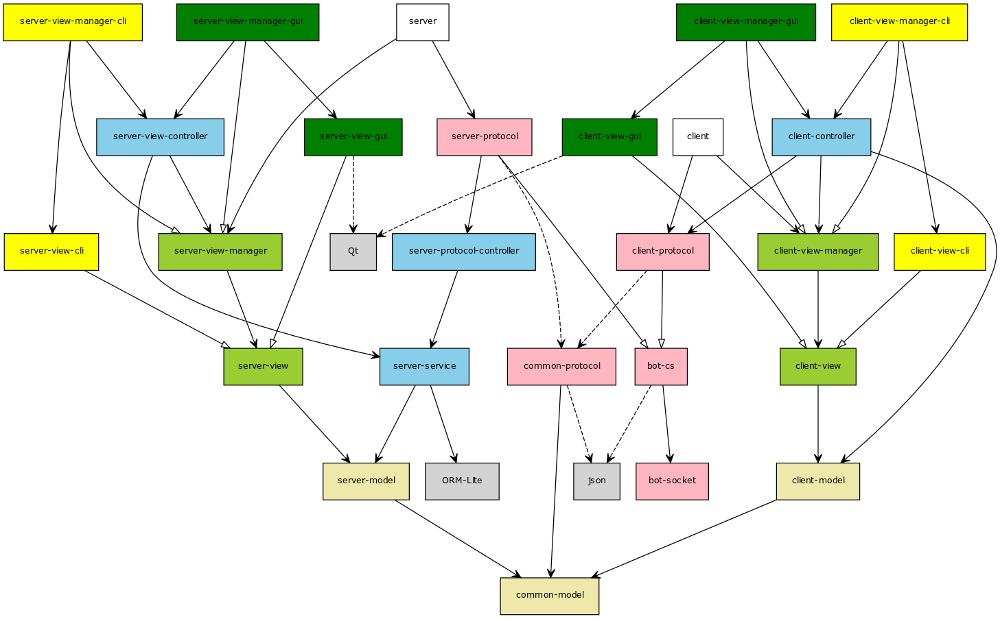

# 分布式温控系统设计与实现

> 2017 BUPT 软件工程大作业
>
> 工程代码及相关文档 基于 [MIT 协议](LICENSE) 发行

## 工程说明

### 开发环境

- 语言：C++ 14 / Qt (GUI Only)
- 系统：
  - Windows 10
  - Ubuntu 16.04
- 依赖：
  - [json](https://github.com/nlohmann/json)
  - bot-cs/bot-socket
  - [ORM-Lite](https://github.com/BOT-Man-JL/ORM-Lite)
  - [Qt 5](https://www.qt.io/)
- 编译器：
  - gcc/clang（命令行 Linux）
  - Visual Studio 2017 - MSVC 15（命令行 Windows）
  - Qt 5（图形化）
- 数据库：
  - [sqlite 3](https://sqlite.org/)（由 ORM-Lite 提供）

### 项目文件

- makefile/
  - [server-cli](makefile/server-cli)（命令行 主控机 Linux）
  - [client-cli](makefile/client-cli)（命令行 从控机 Linux）
- vs-proj/
  - [Air-Conditioner.sln](vs-proj/Air-Conditioner.sln)
  - Air-Conditioner-Server/
    - [Air-Conditioner-Server.vcxproj](vs-proj/Air-Conditioner-Server/Air-Conditioner-Server.vcxproj)（命令行 主控机 Windows）
  - Air-Conditioner-Client/
    - [Air-Conditioner-Client.vcxproj](vs-proj/Air-Conditioner-Client/Air-Conditioner-Client.vcxproj)（命令行 从控机 Windows）
- qt-proj/
  - Air-Conditioner-Server/
    - [Air-Conditioner-Server.pro](qt-proj/Air-Conditioner-Server/Air-Conditioner-Server.pro)（图形化 主控机）
  - Air-Conditioner-Client/
    - [Air-Conditioner-Client.pro](qt-proj/Air-Conditioner-Server/Air-Conditioner-Server.pro)（图形化 从控机）

**编译前**，需要解压第三方库的源文件：

- src/common/json/
  - [json.hpp](src/common/json/json.hpp.zip)
- src/server/ormlite/
  - [sqlite3.h](src/server/ormlite/sqlite3.h.zip)
  - [sqlite3.c](src/server/ormlite/sqlite3.c.zip)
  - [ormlite.h](src/server/ormlite/ormlite.h.zip)

### 源代码文件

- src/common/
  - [common-model.h](src/common/common-model.h)（共享 模型）
  - [common-protocol.h](src/common/common-protocol.h)（共享 协议）
  - [json/json.hpp](src/common/json/json.hpp)（json 库）
  - [bot-socket.h](src/common/bot-socket.h)（socket 库）
  - [bot-cs.h](src/common/bot-cs.h)（基于 socket 的服务器/客户端框架）
  - [common-view.h](src/common/common-view.h)（共享 视图库）
  - [cli-helper.h](src/common/cli-helper.h)（共享 命令行库）
- src/server/
  - ormlite/（ORM Lite 库）
  - ui/（Qt UI 文件）
  - [server.cpp](src/server/server.cpp)（主控机 主函数）
  - [server-model.h](src/server/server-model.h)（主控机 模型）
  - [server-service.h](src/server/server-service.h)（主控机 服务模块）
  - [server-protocol.h](src/server/server-protocol.h)（主控机 协议模块）
  - [server-protocol-controller.h](src/server/server-protocol-controller.h)（主控机 网络层 控制器）
  - [server-view-controller.h](src/server/server-view-controller.h)（主控机 视图层 控制器）
  - [server-view.h](src/server/server-view.h)（主控机 视图 / 视图管理器）
  - [server-view-cli.h](src/server/server-view-cli.h)（主控机 命令行视图）
  - [server-view-manager-cli.cpp](src/server/server-view-manager-cli.cpp)（主控机 命令行视图管理器）
  - [server-view-gui.h](src/server/server-view-gui.h)（主控机 图形化视图）
  - [server-view-manager-gui.cpp](src/server/server-view-manager-gui.cpp)（主控机 图形化视图管理器）
  - [server-view-gui-qt.h](src/server/server-view-gui-qt.h)（主控机 Qt 图形化接口）
  - [server-view-gui-qt.cpp](src/server/server-view-gui-qt.cpp)（主控机 Qt 图形化实现）
  - [log-helper.h](src/server/log-helper.h)（报表导出模块）
  - [time-helper.h](src/server/time-helper.h)（时间转换模块）
- src/client/
  - ui/（Qt UI 文件）
  - [client.cpp](src/client/client.cpp)（从控机 主函数）
  - [client-model.h](src/client/client-model.h)（从控机 模型）
  - [client-protocol.h](src/client/client-protocol.h)（从控机 协议模块）
  - [client-controller.h](src/client/client-controller.h)（从控机 控制器）
  - [client-view.h](src/client/client-view.h)（从控机 视图 / 视图管理器）
  - [client-view-cli.h](src/client/client-view-cli.h)（从控机 命令行视图）
  - [client-view-manager-cli.cpp](src/client/client-view-manager-cli.cpp)（从控机 命令行视图管理器）
  - [client-view-gui.h](src/client/client-view-gui.h)（从控机 图形化视图）
  - [client-view-manager-gui.cpp](src/client/client-view-manager-gui.cpp)（从控机 图形化视图管理器）
  - [client-view-gui-qt.h](src/client/client-view-gui-qt.h)（从控机 Qt 图形化接口）
  - [client-view-gui-qt.cpp](src/client/client-view-gui-qt.cpp)（从控机 Qt 图形化实现）

#### 模块依赖图

[](docs/dependency.svg)

<!--
[common-protocol{bg:lightpink}]->[common-model{bg:palegoldenrod}]
[common-protocol]-.->[json{bg:lightgray}]
[bot-cs{bg:lightpink}]-.->[json]
[bot-cs]->[bot-socket{bg:lightpink}]

[client-model{bg:palegoldenrod}]->[common-model]
[client-view{bg:yellowgreen}]->[client-model]
[client-view-manager{bg:yellowgreen}]->[client-view]
[client-protocol{bg:lightpink}]-^[bot-cs]
[client-protocol]-.->[common-protocol]
[client-controller{bg:skyblue}]->[client-model]
[client-controller]->[client-view-manager]
[client-controller]->[client-protocol]
[client]->[client-protocol]
[client]->[client-view-manager]

[client-view-cli{bg:yellow}]-^[client-view]
[client-view-manager-cli{bg:yellow}]-^[client-view-manager]
[client-view-manager-cli]->[client-view-cli]
[client-view-manager-cli]->[client-controller]

[client-view-gui{bg:green}]-^[client-view]
[client-view-gui]-.->[Qt{bg:lightgray}]
[client-view-manager-gui{bg:green}]-^[client-view-manager]
[client-view-manager-gui]->[client-view-gui]
[client-view-manager-gui]->[client-controller]

[server-model{bg:palegoldenrod}]->[common-model]
[server-view{bg:yellowgreen}]->[server-model]
[server-view-manager{bg:yellowgreen}]->[server-view]
[server-service{bg:skyblue}]->[server-model]
[server-service]->[ORM-Lite{bg:lightgray}]
[server-view-controller{bg:skyblue}]->[server-service]
[server-view-controller]->[server-view-manager]
[server-protocol-controller{bg:skyblue}]->[server-service]
[server-protocol{bg:lightpink}]-^[bot-cs]
[server-protocol]-.->[common-protocol]
[server-protocol]->[server-protocol-controller]
[server]->[server-view-manager]
[server]->[server-protocol]

[server-view-cli{bg:yellow}]-^[server-view]
[server-view-manager-cli{bg:yellow}]-^[server-view-manager]
[server-view-manager-cli]->[server-view-cli]
[server-view-manager-cli]->[server-view-controller]

[server-view-gui{bg:green}]-^[server-view]
[server-view-gui]-.->[Qt{bg:lightgray}]
[server-view-manager-gui{bg:green}]-^[server-view-manager]
[server-view-manager-gui]->[server-view-gui]
[server-view-manager-gui]->[server-view-controller]
-->

### 协议文档

> 2017 分布式温控系统 F 组 通信协议

#### Json 格式

``` json
PACKET = JSON_REQ | JSON_RES \0
```

> 传输的 socket 字符流以 空字符 '\0' 结束

#### 从控机报文 (Request)

``` json
JSON_REQ = {"request":ACTION, "param":PARAM}

ACTION = "auth" | "pulse"

1) ACTION = "auth"
  PARAM = {"room":ROOM_ID, "guest":GUEST_ID}
2) ACTION = "pulse"
  PARAM = {"room":ROOM_ID, "current":TEMP,
           "target":TEMP, "wind":WIND}

ROOM_ID = [string]
GUEST_ID = [string]
TEMP = [double]
WIND = 1 | 2 | 3
```

#### 主控机报文 (Response)

``` json
JSON_RES = {"success":SUCCESS, "response":RESPONSE}

SUCCESS = true | false

1) SUCCESS = false
  RESPONSE = ERR_MSG
2) SUCCESS = true
  RESPONSE = {"hasWind":HAS_WIND, "energy":ENERGY, "cost":COST,
              "on":SERVER_ON, "mode":MODE}

ERR_MSG = [string]
HAS_WIND = true | false
ENERGY = [double]
COST = [double]
SERVER_ON = true | false
MODE = 0 | 1
```

## 相关文档

1. [需求获取](docs/Requirements.md)
2. [面向对象需求分析](docs/User-cases.md)
3. [结构化需求分析](docs/Requirements-Spec.md)
4. [面向对象设计](docs/OO-Design.md)
5. [结构化设计](docs/Structural.md)

## 贡献者

- [John Lee](https://github.com/BOT-Man-JL)
- [@WalkerJG](https://github.com/WalkerJG)
- [@xtdong1001](https://github.com/xtdong1001)
- [@xiaokeZuo](https://github.com/xiaokeZuo)
- [@ZL96](https://github.com/ZL96)